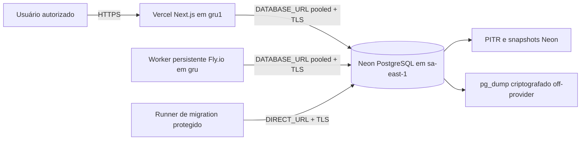

# Decisão de arquitetura de nuvem — PROD-02

## Estado e escopo

- **Status:** decisão definitiva aprovada para planejamento; apenas o banco
  gratuito de staging da PROD-05 foi criado, sem infraestrutura de produção.
- **Data da decisão:** 14 de setembro de 2026.
- **Produto:** CRM Politizai.
- **Escopo:** aplicação, banco, worker, ambientes, segurança operacional,
  observabilidade, backup, restore, migrations e rollback.
- **Fora do escopo:** provisionamento, deploy, DNS, banco remoto, credenciais,
  providers externos, egress e dados reais.

### Atualização: ambiente gratuito temporário

Em 14 de setembro de 2026 foi criado, por autorização posterior, um ambiente
gratuito de construção: Render Free para web, Neon Free para PostgreSQL e worker
somente local. A continuação explícita da PROD-05 formalizou exclusivamente o
banco Neon como staging. Essa sobreposição não substitui a arquitetura
definitiva abaixo, não cria produção, não inicia a PROD-06 e não altera o NO-GO.
O inventário, as evidências e os limites estão em
[`FREE_STAGING_ENVIRONMENT.md`](./FREE_STAGING_ENVIRONMENT.md).

Esta decisão parte do commit
`bcc41c8c32ce19194755f848f822183ba4d45ccd`, sincronizado com `origin/main`, e
reutiliza o aceite local da CRM-64. O estado segue **NO-GO para produção** até
os gates posteriores serem executados e aprovados.

## Decisão executiva

| Componente | Escolha | Região inicial | Isolamento |
|---|---|---|---|
| Web e APIs Next.js | Vercel Pro | `gru1` — São Paulo | dois projetos Vercel |
| PostgreSQL | Neon Launch | AWS `sa-east-1` — São Paulo | dois projetos Neon, não duas branches do mesmo projeto |
| Worker | Fly.io Machine persistente | `gru` — São Paulo | dois apps Fly.io |
| Fila e locks | PostgreSQL existente | mesma região do banco | tabelas e locks do próprio ambiente |
| Código | GitHub privado `Menddon/crm-politizai` | não aplicável | branch protegida e promoção por commit |

Nomes obrigatórios:

- Vercel staging: `crm-politizai-staging`;
- Vercel produção: `crm-politizai`;
- Neon staging: `crm-politizai-staging-db`;
- Neon produção: `crm-politizai-production-db`;
- worker staging: `crm-politizai-worker-staging`;
- worker produção: `crm-politizai-worker-production`.

Nenhum desses recursos foi criado nesta task.

## Topologia

Staging repete a topologia com projetos, banco, worker, secrets, domínio e
telemetria próprios. Nenhuma URL de produção deve existir em Preview ou
staging. Produção nunca deve consumir atores, seeds ou dados demonstrativos.

## Evidência do repositório

- Next.js 16.3.4, React 19.3.0, Node 22 e Prisma 7.10.0;
- aplicação executável como servidor Node e compatível com Vercel Functions;
- worker atual é um processo persistente que executa `pnpm worker`, consulta as
  filas em loop e usa intervalo padrão de um segundo;
- jobs usam PostgreSQL, `FOR UPDATE SKIP LOCKED`, lock com expiração, retries,
  backoff e efeitos idempotentes;
- pool de cada processo usa no máximo cinco conexões;
- migrations usam `prisma migrate deploy`;
- readiness, auditoria, SLI/SLO, incidentes, restore e rollback já possuem base
  local, mas ainda não foram homologados em infraestrutura remota.

## Inspeção read-only do Opadillis na Vercel

A referência estrutural observada pertence à conta pessoal
`mattheusmendon-5037's projects`, no plano **Hobby**, com o projeto `opadilis`
integrado ao repositório privado `Menddon/opadilis`. A configuração observada
usa Functions em `iad1`, Fluid Compute, Vercel Authentication, Standard
Protection, proteção de source maps e comentários/status de Git.

A inspeção não leu nem copiou project ID, org ID, token, variável, segredo ou
arquivo `.vercel`. O CRM não herdará região, IDs ou credenciais do Opadillis.
O plano Hobby serve somente como referência do estado da conta: o CRM exige
**Vercel Pro**, tanto pelo uso comercial quanto pelos limites operacionais.

## Decisão do worker

### Homologação gratuita temporária da PROD-08

Em 14 de setembro de 2026, por autorização explícita para a fase de construção,
o entrypoint persistente foi executado localmente em uma janela controlada
contra o Neon de staging. Um job sintético e idempotente foi processado uma vez,
sem egress, e o processo encerrou graciosamente por `SIGTERM`. A evidência está
em `STAGING_WORKER_REPORT.md`.

Isso não muda a decisão abaixo. Nenhum Fly app ou Vercel Cron foi criado. O
runtime 24x7, reinício automático e health externo permanecem pendentes e são
obrigatórios antes de operação real. O modo transitório custa US$ 0 e existe
somente para desenvolvimento e homologação sintética.

### Opção A — Vercel Cron protegido

É tecnicamente possível no plano Pro executar um cron a cada minuto e proteger
a rota com `CRON_SECRET`. A Vercel avisa, porém, que o disparo pode ocorrer em
qualquer segundo do minuto, que eventos podem ser entregues mais de uma vez e
que execuções podem se sobrepor. Cada disparo também consome uma Function e
fica sujeito à duração, memória e concorrência da plataforma.

Usar Cron exigiria transformar o worker contínuo em um endpoint bounded que
drena apenas um lote por execução. Isso elevaria a latência mínima operacional
de aproximadamente um segundo para até cerca de um minuto, sem garantia de
segundo exato. É inadequado como runtime inicial para SLA, mensagens, callbacks,
dead-letter e várias filas já tratadas pelo mesmo loop.

### Opção B — processo persistente

Uma única Fly Machine em `gru` executará o worker existente. Ela mantém polling
curto, shutdown por `SIGTERM`, reinício do processo e proximidade regional com
Vercel e Neon. O banco continua sendo a fila: não entram Redis, broker ou
microserviço adicional.

### Escolha

**Processo persistente no Fly.io.** É a alternativa com menor mudança no código
validado e melhor previsibilidade para o perfil atual. Iniciar com uma Machine
por ambiente; staging pode ficar desligado fora de janelas de homologação. Os
locks e recibos idempotentes permitem uma segunda réplica futura somente após
teste de concorrência e evidência de backlog.

Vercel Cron permanece alternativa futura para tarefas estritamente periódicas,
não urgentes e idempotentes. Seu uso depende de um runner bounded separado e de
medição que demonstre que atraso de até um minuto é aceitável.

## Banco, pool e migrations

### Conexões

- `DATABASE_URL`: endpoint Neon pooled (`-pooler`), TLS obrigatório, usado por
  Vercel e pelo worker;
- `DIRECT_URL`: endpoint direto, TLS obrigatório, restrito ao runner de
  migrations, backup e restore;
- usuário runtime sem DDL; usuário de migration separado e com privilégios
  mínimos necessários;
- manter o limite atual de cinco conexões por processo no primeiro staging e
  ajustar somente após medir concorrência, saturação e latência;
- recusar host ou banco de outro ambiente no preflight.

O `DIRECT_URL` não deve estar disponível para a aplicação web nem para o worker.
Preview do projeto de produção não recebe credencial de produção; validações de
branch usam o projeto de staging.

### Promoção de schema

Migrations não serão executadas no build da Vercel, pois builds concorrentes
podem disputar a mesma migration. Um runner protegido aplica uma única vez:

1. congelar commit e lista de migrations;
2. aplicar `prisma migrate deploy` em staging com `DIRECT_URL`;
3. executar smoke e reconciliar contagens;
4. criar snapshot/backup antes da janela de produção;
5. obter aprovação humana;
6. aplicar as mesmas migrations em produção;
7. publicar web e worker do mesmo commit.

Mudanças usam `expand → migrate → reconcile → switch → contract`. Rollback de
aplicação só é permitido enquanto o schema permanecer retrocompatível.

## Ambientes e promoção

| Aspecto | Staging | Produção |
|---|---|---|
| Branch de promoção | `staging` | `main` |
| Vercel | `crm-politizai-staging` | `crm-politizai` |
| Banco | projeto Neon staging | projeto Neon produção |
| Worker | app Fly staging | app Fly produção |
| Dados | fictícios ou anonimizados e autorizados | somente dados aprovados |
| Segredos | exclusivos de staging | exclusivos de produção |
| Proteção | Vercel Authentication em todos os deployments | decisão humana descrita abaixo |
| Deploy | aprovação técnica | janela e aprovação negócio/segurança/privacidade |

O mesmo SHA deve identificar web e worker. Promoção não significa copiar banco,
secret, domínio ou configuração entre ambientes.

## Domínio e proteção de acesso

Recomendação de domínio de produção: `crm.politizai.com.br`, condicionada à
confirmação do domínio oficial e do responsável pelo DNS. Staging deve usar o
domínio gerado e protegido pela Vercel ou `staging.crm.politizai.com.br`.

A Vercel Authentication está disponível para todos os deployments. Para um CRM
interno, a recomendação é proteção em todos os deployments como segunda camada,
desde que todos os usuários possam receber acesso de viewer. Se isso impedir o
uso por operadores, produção usará a autenticação do próprio CRM e a proteção
Vercel ficará obrigatória em Preview/staging. Essa escolha é um gate humano.

## Segredos

- usar variáveis Sensitive da Vercel por projeto e ambiente;
- usar Fly Secrets por app;
- usar credenciais Neon distintas por ambiente e por função;
- nunca usar `NEXT_PUBLIC_*` para segredo;
- inventariar proprietário, finalidade, ambiente, data de rotação e consumidor;
- registrar mudança sem registrar valor;
- rotacionar imediatamente credencial suspeita e revogar a anterior;
- manter referências de providers externos vazias até autorização específica.

Segredos não serão copiados do Opadillis, versionados, exibidos em logs ou
inseridos em documentação.

## Observabilidade e operação

Baseline sem add-on pago:

- logs e métricas de Functions na Vercel Pro;
- logs, reinícios e métricas da Machine no Fly.io;
- métricas de compute, storage e conexões no Neon;
- logs estruturados da aplicação com `requestId`, `jobId`, `workspaceId` e
  redaction central;
- estado persistido de jobs, tentativas, dead-letter, auditoria, SLO e
  incidentes já existente no CRM.

Alertas mínimos antes de produção:

- `/api/ready` indisponível ou 5xx acima do orçamento;
- latência p95 acima do SLO;
- uso/saturação de conexões e compute do banco;
- heartbeat do worker ausente;
- idade do job mais antigo, backlog e dead-letter acima do limite;
- migration, backup, snapshot ou restore drill falho;
- armazenamento, compute ou transferência próximos do limite financeiro.

O heartbeat externo, os destinos de alerta e o on-call serão implementados e
homologados nas tasks posteriores. Vercel Observability Plus é opcional, não
entra no baseline.

## Backup, PITR e restore

Produção deve usar Neon Launch com restore window configurada para sete dias —
o default de projeto pago pode ser menor — e snapshots diários agendados. Isso
não substitui a cópia independente:

- `pg_dump -Fc` via endpoint direto;
- arquivo criptografado em storage S3-compatible fora da Neon;
- retenção proposta: 30 diários e 12 mensais;
- checksum e manifesto com versão, horário, migrations e contagens;
- dump pré-release antes de migration relevante;
- restore trimestral em destino isolado e restore adicional antes do go-live;
- remoção segura do ambiente de ensaio depois da reconciliação.

RPO proposto: até 24 horas para a cópia off-provider e até a janela de PITR para
recuperação dentro da Neon. RTO inicial proposto: quatro horas. Jurídico, negócio
e operação precisam aprovar retenção, RPO e RTO antes da criação dos recursos.

Restore nunca sobrescreve produção diretamente: restaurar em branch/projeto
isolado, comparar migrations, contagens, fingerprints e eventos, obter aprovação
e então fazer cutover controlado.

## Rollback

- **Web:** promover novamente uma deployment anterior da Vercel somente se o
  schema for compatível;
- **Worker:** parar a versão defeituosa e iniciar a imagem/commit anterior,
  preservando jobs e recibos no PostgreSQL;
- **Migration:** preferir forward-fix aditivo; proibir down migration destrutiva
  automática;
- **Dados:** restaurar PITR/snapshot/dump em ambiente isolado e fazer cutover
  somente após reconciliação;
- **Configuração:** versionar o inventário e reverter a referência, nunca copiar
  segredo em texto;
- **Domínio:** manter o destino anterior durante a janela e usar TTL planejado.

## Riscos e decisões humanas pendentes

1. Aprovar Vercel Pro, Neon Launch e Fly.io, incluindo forma de pagamento.
2. Confirmar domínio oficial, acesso ao DNS e janela de propagação.
3. Decidir a proteção Vercel de produção e quem recebe acesso de viewer.
4. Aprovar RPO, RTO, retenção e fornecedor do backup off-provider.
5. Definir se produção inicia vazia ou recebe migração de dados autorizada; seed
   demonstrativo é proibido.
6. Nomear release owner, migration owner, rollback owner, on-call e aprovadores.
7. Concluir jurídico/DPO, segurança independente e política de dados reais.
8. Autorizar separadamente cada provider externo; esta arquitetura não os ativa.

## Fontes oficiais consultadas

- [Vercel Pro](https://vercel.com/docs/plans/pro-plan)
- [Vercel Cron — uso e preço](https://vercel.com/docs/cron-jobs/usage-and-pricing)
- [Vercel Cron — segurança, duplicidade e concorrência](https://vercel.com/docs/cron-jobs/manage-cron-jobs)
- [Limites de Functions](https://vercel.com/docs/functions/limitations)
- [Regiões da Vercel](https://vercel.com/docs/regions)
- [Deployment Protection](https://vercel.com/docs/deployment-protection)
- [Variáveis Sensitive](https://vercel.com/docs/environment-variables/sensitive-environment-variables)
- [Neon — preços e limites](https://neon.com/pricing)
- [Neon — região São Paulo](https://neon.com/docs/introduction/regions)
- [Neon — connection pooling](https://neon.com/docs/connect/connection-pooling)
- [Neon — backups com `pg_dump`](https://neon.com/docs/manage/backups)
- [Prisma com Neon](https://neon.com/docs/guides/prisma)
- [Prisma Migrate Deploy](https://www.prisma.io/docs/orm/reference/prisma-cli-reference#migrate-deploy)
- [Next.js — deployment](https://nextjs.org/docs/app/getting-started/deploying)
- [Next.js — variáveis de ambiente](https://nextjs.org/docs/app/guides/environment-variables)
- [Fly.io — regiões](https://fly.io/docs/reference/regions/)
- [Fly.io — preços](https://fly.io/docs/about/pricing/)

Links verificados em 14 de setembro de 2026. Valores e limites devem ser
reconfirmados imediatamente antes de qualquer contratação.
