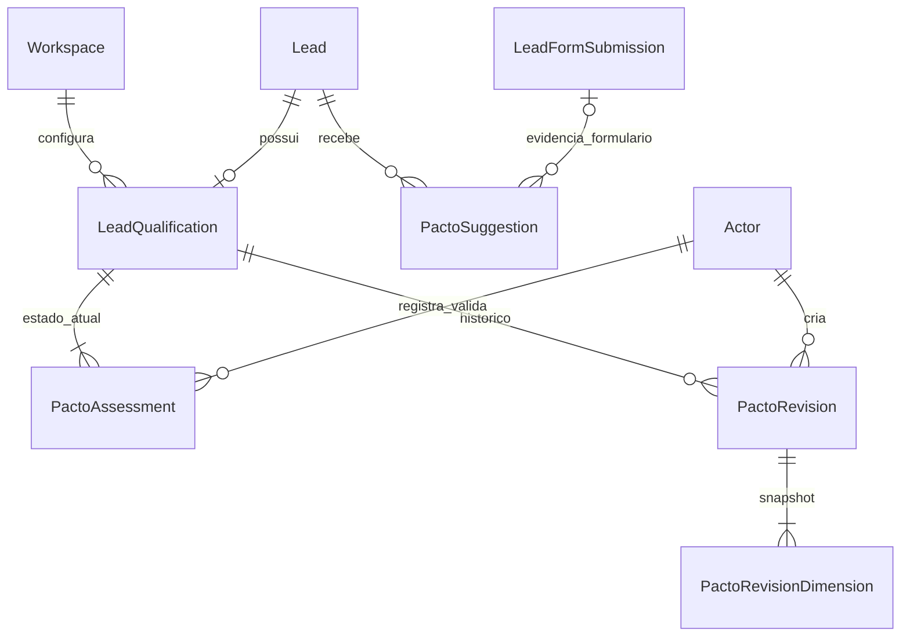
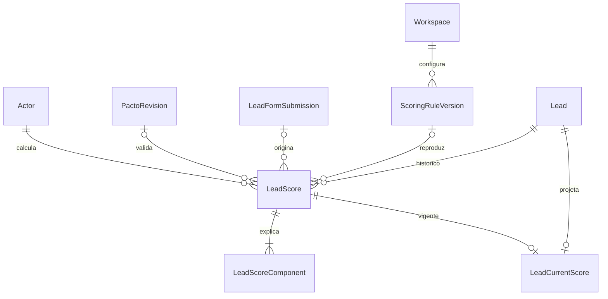
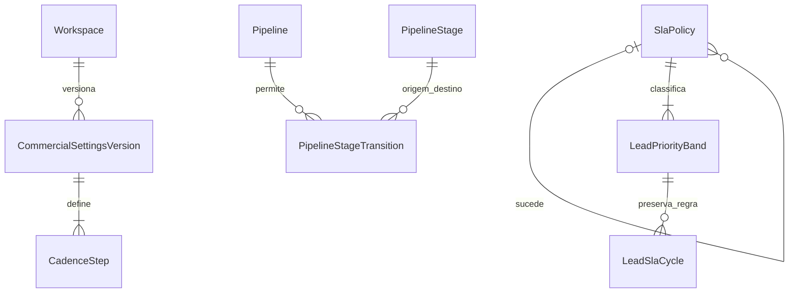
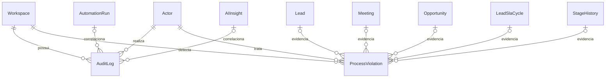
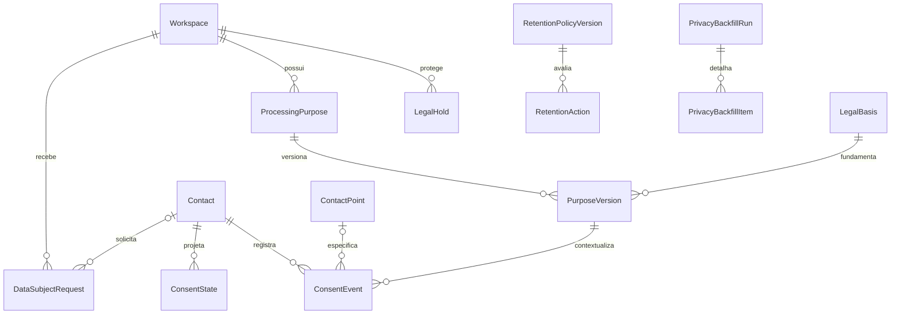
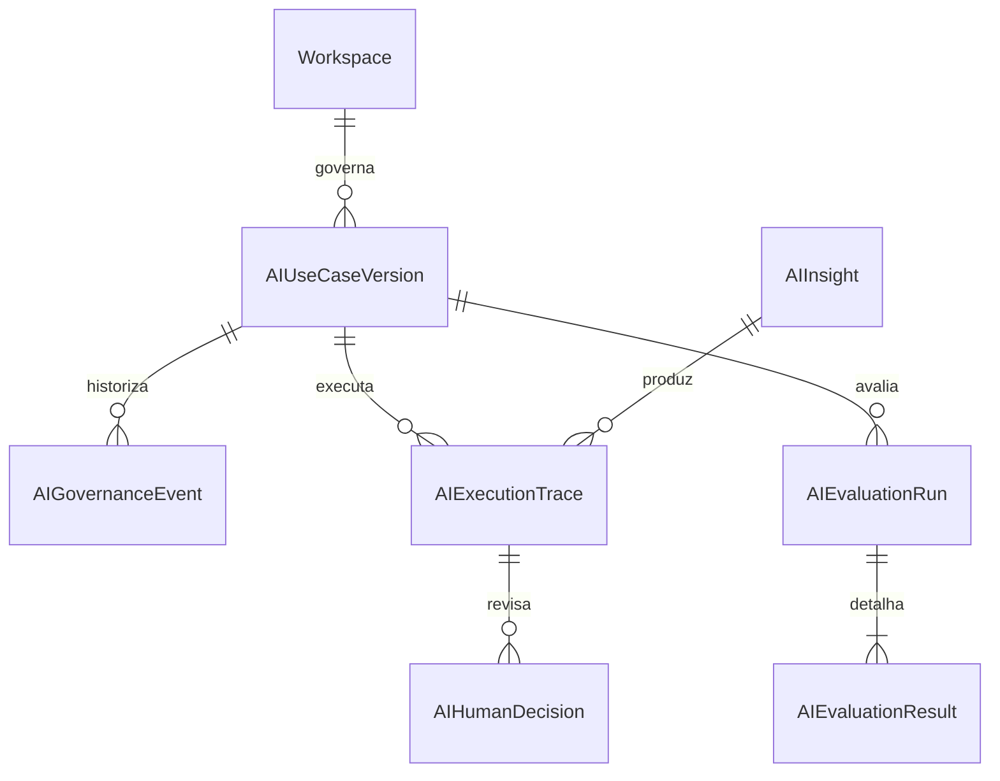
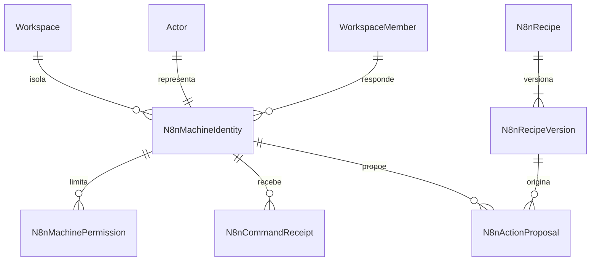
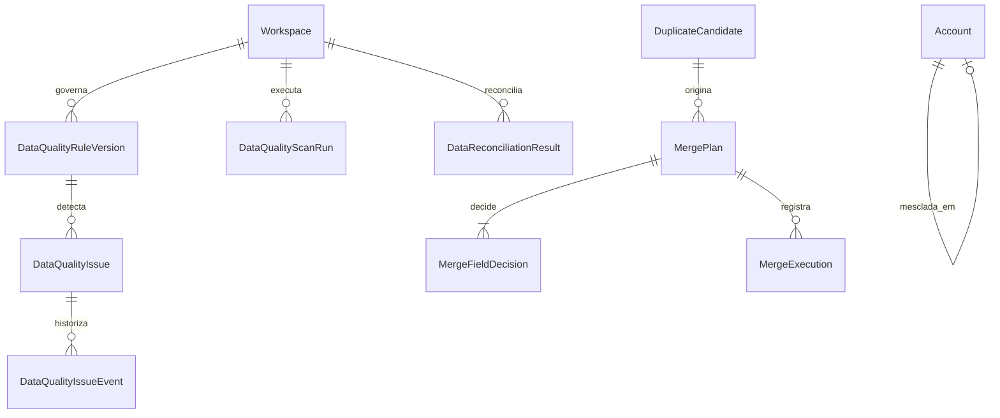

# Modelo de dados

> CRM-49: `Subscription` preserva snapshots do contrato; `RevenueMovement` e `SubscriptionHistory` são append-only. Mudanças futuras usam `SubscriptionScheduledChange` e backfills possuem runs/itens rastreáveis. Veja [REVENUE_LEDGER.md](./REVENUE_LEDGER.md).

## Objetivo e estado

Este documento descreve o modelo relacional vigente no aceite local do MVP,
após a CRM-30. Ele é a fonte única da verdade estrutural do Politizai CRM e
sustenta entrada, distribuição, SLA, trabalho comercial, métricas, automações,
IA local e auditoria. O schema está em `prisma/schema.prisma`; regras que o
Prisma não expressa estão versionadas nas 23 migrations SQL existentes.

O modelo contém somente o domínio comercial interno da Politizai. Conta pode
representar a instituição compradora, mas cidadãos, atendimentos e dados
operacionais de gabinete pertencem ao Politizai OS e são proibidos nesta base.
Consulte o contrato de projeto Supabase dedicado, schema privado `crm`, dados
permitidos, RBAC, finalidade, retenção e deny-by-default em
[`CRM_COMMERCIAL_DATA_BOUNDARY.md`](./CRM_COMMERCIAL_DATA_BOUNDARY.md).

## Qualificação PACTO

`LeadQualification` representa o agregado atual e mantém `revision`, mínimo
usado na validação e ator/data da validação mais recente. Os cinco campos
legados permanecem como projeções compatíveis e não são usados como histórico.

`PactoAssessment` contém uma linha atual por lead e dimensão. Status `UNKNOWN`
é ausência de investigação e exige que evidência/origem permaneçam nulas;
qualquer outro status exige evidência e origem. Ator/data de registro e de
validação são FKs compostas do mesmo workspace.

`PactoRevision` guarda um snapshot por salvamento, com tipo rascunho ou
validação, versão, mínimo requerido, quantidade investigada, presença de
desqualificante e prontidão calculada. `PactoRevisionDimension` guarda as cinco
dimensões daquela revisão. Triggers impedem update, delete e truncate nessas
tabelas.

`PactoSuggestion` guarda apenas sinais de `FORM` ou `AI`. O banco exige
submissão no primeiro caso e a proíbe no segundo. Sugestões também são
append-only e nunca atualizam `PactoAssessment`.



Soft delete não se aplica às evidências, revisões ou sugestões: corrigir requer
nova revisão. Nenhuma FK introduzida usa cascata destrutiva. O mínimo PACTO é
uma coluna tipada do workspace com `CHECK` entre 1 e 5 e é copiado para o
snapshot histórico.

## Scoring versionado

`ScoringRuleVersion` persiste pesos, penalidades, arredondamento, limiar de
capacidade e faixas P1/P2/P3 em colunas tipadas. Há uma versão ativa por chave e
workspace. Somente o estado `active` pode mudar; pesos e limites históricos são
imutáveis por trigger.

`LeadScore` é um cálculo append-only com fonte, faixa, regra, versão, snapshot
de entrada, motivo, ator e vínculo opcional ao formulário ou revisão PACTO.
`LeadScoreComponent` detalha pontos, máximo, razão, evidência e ausência por
fator. `LeadCurrentScore` é a única projeção mutável e aponta para exatamente um
score do mesmo lead/workspace, com revisão otimista.



Score e componentes não aceitam update, delete ou truncate. Uma nova regra não
reescreve cálculos anteriores; recálculo cria outro `LeadScore`. Sugestões de IA
têm fonte própria e não recebem `currentRevision`.

## Princípios

- todo dado de negócio pertence a um `Workspace`;
- toda relação entre entidades do workspace inclui `workspaceId` na chave
  estrangeira;
- IDs são UUIDs estáveis e não carregam significado comercial;
- estado atual consultável fica em colunas relacionais tipadas;
- eventos e snapshots históricos ficam em tabelas próprias e não são
  reconstruídos a partir do estado atual;
- nenhuma relação usa `ON DELETE CASCADE`;
- valores BRL são `bigint` em centavos;
- datas são `timestamptz(3)` e representam instantes;
- JSON não substitui colunas usadas para filtro, ordenação, integridade ou
  métricas.

## Identidade, acesso e atores

Os quatro conceitos abaixo são separados de propósito:

| Entidade | Responsabilidade |
|---|---|
| `User` | Identidade global da pessoa |
| `WorkspaceMember` | Vínculo do usuário com um workspace e um papel |
| `TeamMember` | Participação comercial em um time e função como SDR ou closer |
| `Actor` | Autor imutável de uma ação: `HUMAN`, `SYSTEM`, `AUTOMATION` ou `AI_AGENT` |
| `LocalCredential` | Hash de senha, versão da credencial e bloqueio por falhas |
| `AuthSession` | Sessão revogável ligada a workspace, usuário, membership e ator humano |

Um ator humano exige `userId` e uma membership ativa no mesmo workspace. Atores
não humanos não podem apontar para usuário. `Role`, `Permission` e
`RolePermission` modelam autorização; permissão de interface nunca será
suficiente sem validação futura no serviço.

`RolePermission.scope` limita cada concessão a todo o workspace, à equipe ou ao
próprio responsável/fila da equipe. `Queue.teamId` permite que uma fila seja um
escopo operacional explícito para a equipe sem transformar ausência de dono em
acesso implícito.

`LocalCredential.passwordHash` guarda o formato versionado de `scrypt`; senha em
texto nunca é persistida. `AuthSession.tokenHash` guarda apenas SHA-256 do token
opaco que fica no cookie. A sessão registra expiração, revogação, última
atividade, IP e user agent limitados. Um trigger diferível rejeita sessão cujo
ator não seja humano ou não represente o mesmo usuário.

`createdByActorId` e `updatedByActorId` existem nas entidades mutáveis em que a
autoria é aplicável. Entidades de evento usam o ator e o instante do evento, sem
simular um `updatedAt` que não deveria existir. `Workspace`, `User` e
`Permission` são raízes administrativas/globais e não dependem de um ator do
próprio workspace para nascer.

## Responsabilidade operacional

`Queue` é uma entidade persistida. Uma fila com `isGeneral = true` representa a
fila geral e é um responsável operacional explícito, não a ausência de dono.
Há no máximo uma fila geral ativa por workspace.

O banco exige exatamente uma das opções abaixo para cada lead aberto no modelo:

- `ownerMemberId`; ou
- `queueId`.

A mesma regra XOR é aplicada a `Task` e `Conversation`. `CustomerHandoff` também
exige um destino exato: membro ou fila.

`Lead.routingQueueId` preserva a fila responsável pelo round-robin mesmo quando
o estado atual aponta para um SDR. `WorkspaceMember.leadReceivingPausedAt`
registra indisponibilidade voluntária com motivo e ator. Usuário, membership ou
vínculo de equipe inativo/soft-deleted nunca participa do sorteio.

## Catálogo de entidades

### Organização e autorização

- `Workspace`: tenant, timezone e estado operacional;
- `User`: identidade global normalizada por e-mail;
- `WorkspaceMember`: usuário, workspace, papel e situação do acesso;
- `Team`: agrupamento comercial;
- `TeamMember`: membro do workspace, time e função comercial;
- `Role`, `Permission`, `RolePermission`: RBAC relacional;
- `Actor`: autoria humana ou técnica para histórico e auditoria.

A CRM-18 não adiciona tabela nem migration: reutiliza essas relações e seus
estados tipados. Inativar uma `WorkspaceMember` não remove `User`, `Actor` nem
fatos comerciais; sessões abertas são revogadas e leads/tarefas abertas mudam
por atribuições e eventos novos. Vínculos de `TeamMember` são inativados por
soft delete e podem ser restaurados sem perder sua identidade histórica.

### Configurações comerciais iniciais

- `SlaPolicy`: prazo de primeira resposta e antecedência do alerta;
- `LeadPriorityBand`: faixas tipadas P1, P2 e P3 ligadas à operação de SLA;
- `ScoringRuleVersion`: pesos, penalidades e faixas versionados do score;
- `LossReason`: catálogo de motivos de perda de oportunidade;
- `DisqualificationReason`: catálogo separado de desqualificação de lead;
- `OfferTemplate`: oferta configurável ligada a produto, sem criar proposta ou
  oportunidade fictícia.

Os catálogos são separados para impedir que um motivo de desqualificação seja
usado como motivo de perda. `Lead.disqualificationReasonId` e
`Opportunity.lossReasonId` são referências opcionais e isoladas pelo workspace.
`OfferTemplate` é configuração; `Offer` continua sendo o item comercial
transacional de uma oportunidade.

### Configurações comerciais versionadas

`Workspace` mantém a projeção operacional vigente: mínimo PACTO, duração padrão
de reunião, estratégia/limite de distribuição, limites de estagnação e número
da revisão. Cada mudança cria um `CommercialSettingsVersion` imutável;
`CadenceStep` guarda D0, D1 e demais tentativas em linhas tipadas e append-only.

`SlaPolicy.version` e `supersedesPolicyId` formam a cadeia de versões do SLA.
As faixas P1/P2/P3 antigas ficam inativas, mas continuam referenciadas por
`LeadSlaCycle`. `ScoringRuleVersion` já cumpre o mesmo papel para `LeadScore`.

`PipelineStageTransition` persiste uma aresta de etapa por workspace/pipeline,
com estado ativo e atores de criação/alteração. Etapas e códigos semânticos não
são apagados pelo editor; `StageHistory` mantém intervalos já ocorridos.



Nenhuma tabela de configuração histórica usa cascata destrutiva. Produtos,
ofertas-modelo e motivos são inativados quando saem de uso; as FKs de leads,
oportunidades e propostas permanecem válidas.

### Aquisição, identidade do lead e qualificação

- `Contact`: pessoa canônica do workspace, independente do ciclo comercial;
- `ContactPoint`: telefone/e-mail original e normalizado, primário, qualidade,
  verificação e opt-out por Contact;
- `ContactIdentityReview`: colisão explícita entre Contacts, com evidência e
  decisão humana auditada, sem merge automático;
- `ContactBackfillRun`, `ContactBackfillItem`: execução, cursor e resultado
  idempotente do vínculo legado;
- `LeadSource`: origem tipada do lead;
- `AcquisitionCampaign`: campanha de aquisição tipada e consultável;
- `AcquisitionCreative`: criativo pertencente à campanha;
- `Lead`: projeção comercial legada, estado atual, responsável, prioridade, SLA,
  última atividade e próxima ação;
- `LeadFormSubmission`: cada entrada bruta e idempotente que foi ligada ao lead;
- `LeadIdentityReview`: pendência humana gerada por telefone já existente, com
  divergências tipadas e evidências comparadas;
- `RoundRobinState`: cursor serializado por Fila Geral e contador de decisões;
- `LeadAssignment`: evento append-only de atribuição e redistribuição;
- `LeadSlaCycle`: relógio histórico de cada submissão aceita;
- `OperationalAlert`: pendência persistida quando a Fila Geral recebe o lead;
- `LeadQualification`: estado atual dos cinco critérios PACTO em colunas;
- `LeadScore`, `LeadScoreComponent`: avaliações históricas explicadas;
- `LeadCurrentScore`: projeção explícita da pontuação vigente;
- `Tag`, `LeadTag`: classificação e histórico de aplicação/remoção.

Um `Lead` pode receber várias `LeadFormSubmission`. A submissão preserva
`rawPayload` para rastreabilidade, mas canal, resultado, origem, campanha,
criativo, dados submetidos, consentimento, data, telefone e e-mail normalizados
são colunas tipadas. A identidade consolidada não é duplicada a cada envio. Nos
estados de entrada (`RECEIVED`, `NORMALIZED` ou `REJECTED`), a submissão ainda
não aponta para um lead; `leadId` torna-se obrigatório exatamente quando o
status muda para `LINKED`.

O `Lead` separa aquisição inicial de última conversão por meio de referências
distintas e guarda `conversionCount`, `latestSubmissionAt` e
`needsIdentityReview`. Nome, e-mail, cargo, organização, localidade, interesse
inicial e orçamento continuam sendo o estado consolidado. O estado de contato é
um enum que distingue ausência, consentimento, negativa e `DO_NOT_CONTACT`.
Na CRM-33, `Lead.contactId` e `LeadFormSubmission.contactId` foram adicionados
como vínculos opcionais para compatibilidade. O fluxo de entrada faz dual write
na mesma transação e mantém os campos antigos; nenhum contract ou merge foi
executado.

### Funil e receita

- `Pipeline`: funil de lead ou de oportunidade;
- `PipelineStage`: etapa ordenada pertencente ao funil;
- `StageHistory`: entrada e saída temporal de lead ou oportunidade;
- `Opportunity`: negócio ligado ao lead, com dono, etapa e valor;
- `Product`: catálogo de produto e preço de lista;
- `Offer`: item/proposta comercial ligado à oportunidade e ao produto;
- `CustomerHandoff`: passagem explícita entre membros ou para fila.

O `StageHistory` guarda `enteredAt`, `exitedAt`, `enteredByActorId`,
`exitedByActorId`, `transitionOrigin`, `transitionReason` e
`managerCorrection`. Há no máximo uma permanência aberta por lead ou oportunidade.
A duração é calculável por `exitedAt - enteredAt`; não é salva como número
decorativo. O banco garante que a etapa pertence ao pipeline informado e que o
alvo é exatamente um lead ou uma oportunidade. Um trigger permite somente o
primeiro fechamento do intervalo aberto e rejeita reescrita, exclusão ou
truncate; correções comerciais criam um novo intervalo identificado.

Etapas do pipeline padrão de lead possuem `leadStageCode` tipado e único entre
etapas ativas do pipeline. O código preserva a semântica das oito etapas mesmo
que o nome de apresentação evolua. A migration CRM-14 só converte o pipeline
estrutural antigo quando seu fingerprint completo de seis etapas está intacto;
configurações manuais divergentes não são reescritas silenciosamente.

Etapas do pipeline padrão de oportunidade usam `opportunityStageCode` tipado:
`MEETING_SCHEDULED`, `MEETING_HELD`, `OPPORTUNITY_CONFIRMED`, `PROPOSAL`,
`NEGOTIATION`, `WON` e `LOST`. Um trigger impede misturar códigos de lead e de
oportunidade no pipeline errado. A migration CRM-16 converte somente o pipeline
Vendas estrutural do seed cujo fingerprint anterior completo está intacto; um
pipeline customizado não é reinterpretado silenciosamente.

`Opportunity` guarda `productId` ou `interestDescription`, closer,
`amountCents`, `mrrCents`, `tcvCents`, probabilidade manual em basis points,
etapa, previsão de fechamento, motivo de perda, notas comerciais, revisão e a
projeção relacional da próxima ação. Produto ou interesse é obrigatório. Valores
monetários não podem ser negativos; estados abertos exigem o trio de próxima
ação e estados fechados o proíbem. A FK composta da projeção aponta para uma
tarefa da mesma oportunidade e do mesmo workspace.

`Offer` é uma proposta persistida, não o mesmo objeto que `OfferTemplate`.
Quantidade, preço e desconto permanecem em centavos; a proposta precisa de
valor positivo ou justificativa explícita. Ganho exige produto e valor. Perda
mantém `LossReason`. A reabertura não apaga `closedAt`, ofertas ou histórico: o
serviço registra um novo intervalo e o motivo corretivo.

### Trabalho e comunicação

- `Meeting`: compromisso de 30 ou 40 minutos, closer, início/fim, fuso,
  observação, status, resultado e revisão otimista;
- `MeetingHistory`: revisão append-only de cada agendamento, confirmação,
  remarcação, cancelamento, comparecimento ou no-show;
- `Activity`: fato operacional ocorrido, com tipo, direção e duração opcional;
- `Activity`: também guarda resultado tipado, observação, snapshot da próxima
  ação, valores anteriores/posteriores e referência ao fato corrigido;
- `Task`: próxima ação atribuída a membro ou fila, com tipo, prazo, prioridade,
  estado, conclusão e resultado; `IMMEDIATE_CALL` liga uma tarefa única ao ciclo
  de SLA que a originou;
- `Note`: nota ligada ao lead e opcionalmente à oportunidade correspondente;
- `Conversation`: thread por canal e responsável operacional;
- `Message`: mensagem individual, direção, status e autoria; simulações locais
  usam `isSimulated` e rótulo obrigatório, sem fingir envio externo.

Quando uma entidade contém simultaneamente `leadId` e `opportunityId`, a chave
estrangeira composta impede que a oportunidade pertença a outro lead.

Atividades são append-only no PostgreSQL. `UPDATE`, `DELETE` e `TRUNCATE` são
rejeitados por trigger; corrigir um fato exige outra atividade ligada por
`correctsActivityId`. O ator relacionado classifica a autoria como `HUMAN`,
`SYSTEM`, `AUTOMATION` ou `AI_AGENT`.

A próxima ação vigente é a tarefa ativa (`OPEN` ou `IN_PROGRESS`) de menor
`dueAt`, com desempate por `createdAt` e `id`. `Lead.nextActionTaskId`,
`nextActionAt` e `nextActionDescription` são uma projeção atômica dessa tarefa,
não uma segunda fonte de verdade. O trio é totalmente preenchido ou totalmente
nulo; o query service detecta um lead aberto sem tarefa ativa e também projeções
inconsistentes. Concluir tarefa exige `completedAt` e resultado não vazio; uma
tarefa seguinte só nasce quando informada explicitamente no comando.

`Lead.lastInboundResponseAt` e `awaitingHumanResponse` registram o sinal
operacional de resposta. Uma mensagem recebida ativa o sinal, e uma mensagem
enviada posterior o resolve. Primeira tentativa e primeira conexão continuam
nos ciclos de SLA, calculadas em segundos a partir dos timestamps persistidos.

`Meeting` exige lead, closer, `scheduledStartAt`, `scheduledEndAt`, duração e
timezone. Checks mantêm a duração em 30 ou 40 minutos e o intervalo equivalente.
Confirmação, cancelamento, comparecimento e no-show possuem timestamps próprios
compatíveis com o status. Cada mutação incrementa `revision` e acrescenta uma
linha em `MeetingHistory`, cujo par reunião/revisão é único e protegido contra
update, delete e truncate. A tarefa do closer e os fatos da timeline continuam
entidades distintas desse histórico.

### Automação, IA e operação técnica

- `AutomationRule`: chave estável por workspace, origem predefinida, gatilho,
  ação, estado e versão da configuração;
- `AutomationRun`: execução idempotente ligada opcionalmente ao lead, reunião e
  oportunidade por colunas relacionais, com snapshots imutáveis da versão,
  gatilho, ação, condições e configuração usadas;
- `AutomationAttempt`: cada claim do worker, com número, lock lógico, resultado
  ou erro preservado;
- `AutomationEffect`: recibo único que confirma o efeito de domínio no mesmo
  commit e impede duplicação em retry;
- `Job`: unidade local idempotente, agendável, bloqueável e com tentativas
  limitadas;
- `Notification`: notificação interna persistida, destinada a um membro e
  correlacionável ao run, lead ou oportunidade;
- `AIInsight`: recomendação versionada e explicável;
- `AuditLog`: trilha append-only de ação, ator, entidade e mudança;
- `ImportJob`: progresso, contadores e relatório persistido de uma importação
  CSV local;
- `WebhookEvent`: envelope bruto idempotente do webhook local simulado;
- `SavedView`: preferência flexível de filtros, ordenação e colunas.

Na CRM-09, o JSON de `SavedView` continua restrito a preferências validadas por
schema; nenhum dado usado para filtrar ou medir leads migrou para JSON. Estado,
cidade, cargo e capacidade permanecem colunas relacionais e receberam índices
compostos por workspace. Score vigente disponível, faixa de prioridade e SLA
são lidos do registro histórico mais recente, sem reescrever o histórico.

`AIInsight` separa `facts`, `inferences` e `missingData`. A CRM-25 acrescenta
agente, provider solicitado e efetivo, modo, modelo opcional, versão do motor,
chave/versão do prompt, fingerprint do pedido, confiança, duração, falha
controlada e solicitante humano. O restante do resultado estruturado permanece
em `evidence`; gerar a recomendação não atualiza estado comercial.
`requiresConfirmation` e o par `confirmedByActorId`/`confirmedAt` sustentam o
ciclo humano implementado na CRM-26. Aceite total/parcial e rejeição evoluem o
status tipado; as alterações de PACTO, score e tarefa passam pelos próprios
serviços de domínio. Um trigger impede apagar ou reescrever a evidência e a
proveniência, permitindo apenas a evolução de estado e confirmação. O adaptador
compatível é injetável, mas nenhuma chamada externa ou chave está habilitada.

Na CRM-27, consultas do Copilot usam `targetType = WORKSPACE` e
`agentType = MANAGER_COPILOT`. O `AIInsight` guarda provider, prompt e modo;
fórmula, filtros, números e chaves dos registros relacionados ficam no
`AuditLog` correlacionado. A confirmação atualiza somente o estado do insight e
cria novo log append-only com `domainMutationExecuted = false`. A permissão
relacional `ai.manager.query` separa consulta gerencial de `ai.use` no lead.

## Diagrama relacional

O diagrama agrupa relações principais; todas as relações de negócio também
carregam `workspaceId`, mesmo quando ele não aparece no rótulo.

```mermaid
erDiagram
  Workspace ||--o{ WorkspaceMember : possui
  Workspace ||--o{ Actor : registra
  User ||--o{ WorkspaceMember : participa
  User ||--o{ Actor : representa
  User ||--o| LocalCredential : autentica
  User ||--o{ AuthSession : inicia
  Workspace ||--o{ AuthSession : isola
  WorkspaceMember ||--o{ AuthSession : vincula
  Actor ||--o{ AuthSession : identifica
  Role ||--o{ WorkspaceMember : autoriza
  Role ||--o{ RolePermission : recebe
  Permission ||--o{ RolePermission : concede
  Team ||--o{ TeamMember : agrega
  WorkspaceMember ||--o{ TeamMember : participa

  Workspace ||--o{ Contact : possui
  Contact ||--o{ ContactPoint : comunica
  Contact ||--o{ ContactIdentityReview : revisa
  Contact ||--o{ ContactBackfillItem : migra
  ContactBackfillRun ||--o{ ContactBackfillItem : processa
  Contact o|--o{ Lead : identifica
  Contact o|--o{ LeadFormSubmission : identifica

  Workspace ||--o{ LeadSource : configura
  Workspace ||--o{ AcquisitionCampaign : configura
  AcquisitionCampaign ||--o{ AcquisitionCreative : possui
  Workspace ||--o{ Queue : possui
  Workspace ||--o{ SlaPolicy : configura
  SlaPolicy ||--o{ LeadPriorityBand : define
  DisqualificationReason o|--o{ Lead : explica
  LossReason o|--o{ Opportunity : explica
  LeadSource ||--o{ Lead : origina
  AcquisitionCampaign o|--o{ Lead : atribui
  AcquisitionCreative o|--o{ Lead : atribui
  WorkspaceMember o|--o{ Lead : atende
  Queue o|--o{ Lead : atende
  Queue ||--o| RoundRobinState : controla
  TeamMember o|--o{ RoundRobinState : ultimo_cursor
  Lead ||--o{ LeadFormSubmission : consolida
  Lead ||--o{ LeadAssignment : atribui
  Lead ||--o{ LeadSlaCycle : mede
  LeadFormSubmission ||--|| LeadSlaCycle : inicia
  LeadSlaCycle ||--|| Task : exige
  Queue ||--o{ OperationalAlert : alerta
  Lead ||--o{ OperationalAlert : sinaliza
  Lead ||--o{ LeadIdentityReview : revisa
  LeadFormSubmission ||--o| LeadIdentityReview : origina
  Lead ||--o| LeadQualification : qualifica
  Lead ||--o{ LeadScore : pontua
  Lead ||--o{ LeadTag : recebe
  Tag ||--o{ LeadTag : classifica

  Pipeline ||--o{ PipelineStage : ordena
  PipelineStage ||--o{ Lead : etapa_atual
  Lead ||--o{ StageHistory : percorre
  Lead ||--o{ Opportunity : gera
  PipelineStage ||--o{ Opportunity : etapa_atual
  Opportunity ||--o{ StageHistory : percorre
  Opportunity ||--o{ Offer : recebe
  Product ||--o{ Offer : compoe
  Product ||--o{ OfferTemplate : configura
  OfferTemplate o|--o{ Offer : origina
  WorkspaceMember ||--o{ Opportunity : conduz

  Lead ||--o{ Meeting : agenda
  Meeting ||--o{ MeetingHistory : preserva
  WorkspaceMember ||--o{ Meeting : conduz
  Actor ||--o{ MeetingHistory : registra
  Lead ||--o{ Activity : historiza
  Lead ||--o{ Task : demanda
  Lead ||--o{ Note : documenta
  Lead ||--o{ Conversation : conversa
  Conversation ||--o{ Message : contem

  AutomationRule ||--o{ AutomationRun : executa
  Lead o|--o{ AutomationRun : correlaciona
  Meeting o|--o{ AutomationRun : agenda
  Opportunity o|--o{ AutomationRun : encerra
  AutomationRun o|--o{ Activity : registra
  AutomationRun o|--o{ Task : cria
  AutomationRun o|--o{ Message : simula
  AutomationRun o|--o{ Notification : notifica
  AutomationRun o|--o{ CustomerHandoff : prepara
  WorkspaceMember ||--o{ Notification : recebe
  Lead o|--o{ AIInsight : recomenda
  Opportunity o|--o{ AIInsight : recomenda
  Actor ||--o{ AuditLog : pratica
  Lead ||--o{ CustomerHandoff : transfere
  WorkspaceMember ||--o{ SavedView : salva
  Workspace ||--o{ ImportJob : importa
  Workspace ||--o{ WebhookEvent : recebe
  Workspace ||--o{ Job : processa
```



## Integridade e isolamento

As referências compostas (`workspaceId`, `id`) tornam inválidos, no PostgreSQL,
por exemplo:

- um lead do workspace B com origem do workspace A;
- um registro criado com ator de outro workspace;
- uma etapa pertencente a outro pipeline;
- uma atividade ligada a uma oportunidade de outro lead;
- um handoff para membro ou fila de outro workspace.

Triggers validam ainda o discriminador de `Pipeline`: leads só usam pipeline
`LEAD`; oportunidades só usam pipeline `OPPORTUNITY`.

O isolamento relacional reduz falhas acidentais, mas não substitui o filtro de
workspace nem a autorização nos futuros repositórios e serviços.

## Unicidade e deduplicação

As seguintes chaves são únicas somente entre registros ativos do mesmo
workspace:

- chave de papel, origem e fila;
- nome de time e pipeline;
- referência externa de campanha e criativo;
- posição e nome de etapa dentro do pipeline;
- SKU de produto e nome de tag;
- telefone normalizado do lead;
- valor normalizado ativo por Contact e tipo;
- um ponto primário ativo por Contact e tipo;
- combinação ativa lead/tag;
- pipeline padrão por tipo e fila geral.

Telefone segue E.164 (`+` e de 8 a 15 dígitos significativos). O serviço da
CRM-05 normaliza antes de persistir e nunca decide merge silenciosamente. A
unicidade parcial bloqueia duas identidades ativas com o mesmo telefone, mas
permite reutilização após soft delete. Advisory locks transacionais serializam
telefone e chave de idempotência concorrentes. E-mail normalizado é
indexável, porém não é unicidade rígida de lead para evitar fusões destrutivas de
endereços compartilhados.

O Contact não repete um mesmo ponto ativo internamente, mas Contacts diferentes
podem compartilhar telefone ou e-mail. A colisão é indexada e gera
`ContactIdentityReview`; ela não é resolvida por unicidade global nem por merge
automático. FKs compostas impedem vínculos Contact/Lead/submissão/review entre
workspaces. Opt-out é monotônico no dual write: nova entrada não o remove.

Submissões usam `idempotencyKey` por workspace e webhooks usam
`provider + externalEventId`. Execuções de automação e jobs também têm chave de
idempotência por workspace. O recibo de efeito acrescenta uma terceira
unicidade por workspace para que uma retomada não repita a escrita de domínio.

Na CRM-07, cada linha CSV deriva sua chave do conteúdo, mapeamento, padrões e
número da linha. O `ImportJob` é append-only quanto à identidade, mas atualiza
estado e contadores até finalizar; o relatório flexível fica em
`resultMetadata`. `WebhookEvent.payload` preserva o envelope original, e a chave
externa só pode ser reutilizada com payload semanticamente igual.

Cada duplicidade cria uma `LeadIdentityReview` única por submissão. Seus campos
divergentes são um array de enum; JSON guarda somente os valores comparados e a
evidência da decisão. A política completa está em
[`LEAD_DUPLICATION_POLICY.md`](./LEAD_DUPLICATION_POLICY.md).

## Dinheiro, SLA e datas

- `Product.listPriceCents`, `Opportunity.amountCents`, valores de `Offer`,
  `Lead.budgetCents` e o snapshot de orçamento da submissão são `bigint`, não
  ponto flutuante;
- checks impedem valores negativos e garantem o total da oferta pela fórmula
  `quantidade × preço unitário - desconto`;
- probabilidade é armazenada em basis points (`0..10000`);
- `Lead` exige `slaStartedAt`, `slaDueAt` e `lastActivityAt`; a projeção de
  próxima ação é um trio consistente e pode ser nula somente para permitir a
  detecção explícita de erro operacional ou um lead encerrado;
- a política ativa da entrada se chama `SLA imediato — 0 minutos`; o prazo e a
  tarefa `Ligar agora` são iguais a `receivedAt`;
- `LeadSlaCycle` persiste `receivedAt`, `assignedAt`,
  `automaticAcknowledgedAt`, `firstHumanAttemptAt`, `firstConnectedAt`,
  `firstHumanAttemptSeconds` e `firstResponseTimeSeconds` por submissão;
- checks garantem um único responsável inicial (membro ou fila), ordem temporal
  e equivalência dos tempos em segundos com os timestamps;
- 0–60 segundos é saudável, 61–180 é atenção e acima de 180 é crítico; essas
  faixas não mudam o prazo zero;
- checks impedem vencimento anterior ao início e resposta anterior ao início do
  SLA;
- intervalos de reunião, etapa, automação, importação e handoff têm ordem
  temporal validada;
- reuniões exigem duração de 30 ou 40 minutos, timezone não vazio e timestamps
  de desfecho coerentes com o status;
- exibição e entrada da agenda usam `Workspace.timeZone`, com padrão
  `America/Sao_Paulo`, enquanto o banco persiste instantes em `timestamptz`.

## Soft delete e retenção histórica

Entidades configuráveis ou de estado atual usam `deletedAt`, entre elas
workspace, usuário, memberships, times, fontes, campanhas, filas, leads,
pipelines, oportunidades, produtos, tarefas e conversas. Índices parciais
consideram somente `deletedAt IS NULL` quando a chave pode ser reutilizada.

Entidades históricas não têm soft delete genérico:

- `LeadFormSubmission`, `LeadIdentityReview`, `LeadScore`, `StageHistory`,
  `MeetingHistory`, `AutomationRun`, `AutomationAttempt`, `AutomationEffect`,
  `AuditLog`, `ImportJob`, `WebhookEvent` e
  `CustomerHandoff`
  permanecem como fatos; uma revisão pode mudar apenas de estado, sem apagar a
  evidência original;
- `LeadTag` registra `removedAt` e `removedByActorId`;
- `Message` guarda autoria da exclusão lógica;
- todas as FKs usam `Restrict`, nunca `Cascade`.

Assim, apagar fisicamente um lead com submissões ou histórico é rejeitado. O
fluxo normal deverá atualizar `deletedAt` e auditar a ação. Retenção legal e
anonimização não foram inventadas nesta task e exigirão política explícita.

## Auditoria append-only

`AuditLog`, `LeadAssignment` e `MeetingHistory` não possuem `updatedAt` nem
`deletedAt`.
`Activity` ainda conserva colunas legadas de atualização/soft delete do modelo
inicial, mas não permite usá-las: triggers no PostgreSQL rejeitam `UPDATE`,
`DELETE` e `TRUNCATE` nas três trilhas, inclusive para chamadas que contornem o
Prisma. O log contém ator, ação, tipo e ID da entidade, instante, request ID,
contexto técnico, alterações e metadados.

A CRM-24 tipa `AuditLog.origin` como API, domínio, sistema, automação, IA ou
seed, acrescenta motivo e correlações relacionais opcionais a `AutomationRun` e
`AIInsight`. A resposta administrativa separa valor anterior, posterior e
detalhes, mascarando campos de contato, credenciais, tokens, payload bruto, IP e
user agent. O dado persistido não é reescrito para produzir essa visualização.

`ProcessViolation` persiste tipo, severidade, estado, fingerprint único por
workspace, resumo e evidência, além de vínculos tipados a lead, reunião,
oportunidade, ciclo de SLA e `StageHistory`. O ciclo de estado possui atores e
instantes de detecção, reconhecimento e resolução. Triggers rejeitam alteração
da identidade/evidência, `DELETE` e `TRUNCATE`, mas permitem a transição
controlada do estado. FKs compostas impedem evidências cruzadas entre
workspaces.



A autenticação registra login bem-sucedido, falhas relevantes, logout, expiração
e invalidação. A autorização registra negativas, o serviço administrativo
registra mudança de papel e a entrada de leads registra criação ou anexação na
mesma transação do fato comercial. Os futuros casos de uso deverão repetir esse
padrão.

## Uso de JSON

JSON é permitido somente para conteúdo que não define o eixo relacional de uma
consulta:

- payload bruto de formulário ou webhook;
- entrada/saída e configuração flexível de automação e job;
- evidências PACTO e de score;
- valores comparados como evidência de revisão de identidade;
- fatos, inferências, ausências e evidências de IA;
- diffs e metadados de auditoria;
- configuração de uma visão salva.

Responsável, fila, etapa, prioridade, SLA, origem, campanha, criativo, status,
valores, datas e contadores permanecem em colunas tipadas e indexadas.

## Índices de operação

Os índices cobrem os principais filtros do MVP:

- lead por responsável, fila, etapa, prioridade/SLA, origem inicial e mais
  recente, campanha, criativo, preferência de contato, revisão pendente, última
  atividade, próxima ação e criação;
- submissão por canal, resultado, telefone, origem e data; revisão por time,
  lead, estado e criação;
- oportunidade por responsável, etapa, status e previsão de fechamento;
- tarefa por responsável/fila, tipo, status, prioridade e vencimento;
- ciclos de SLA por lead, responsável/fila inicial, faixa e recebimento;
- atribuições por lead, destino e instante; cursor de round-robin por fila;
- alertas operacionais abertos por fila e lead;
- reunião por responsável, status e início; histórico por reunião e revisão;
- atividades, mensagens e históricos por alvo e data;
- automações, notificações, imports, webhooks e jobs por status e data;
- auditoria por ator, ação, origem, correlação e instante;
- achados por tipo, estado, severidade, alvo e data de detecção.

O custo e os planos de consulta deverão ser medidos quando os casos de uso e
volumes reais existirem. Nenhum índice de analytics foi adicionado por palpite.

## Privacidade, consentimento e retenção — CRM-36

`DataCategory`, `ProcessingPurpose`, `PurposeVersion` e `LegalBasis` formam o
catálogo versionado por workspace. Aprovação ou ativação exige autoria,
instante e referência adequada; versões publicadas não podem ser reescritas.
A configuração inicial é técnica e fica `PENDING_LEGAL`.

`ConsentEvent` guarda fatos append-only de concessão, negativa, revogação,
opt-out e correção, com finalidade/versão, canal, ContactPoint opcional, origem,
efeito, evidência, ator, instante e idempotência. `ConsentState` é a projeção
corrente independente por Contact, finalidade, canal e ponto de contato. Os
índices parciais permitem no máximo um estado corrente em cada granularidade;
triggers rejeitam `UPDATE`, `DELETE` e `TRUNCATE` dos eventos.

`RetentionPolicyVersion` relaciona propósito, base e categorias.
`RetentionAction` registra preview, bloqueadores, aprovação e resultado sem
apagar história. `LegalHold` protege Contact, solicitação ou categoria.
`DataSubjectRequest` representa acesso, correção, portabilidade, oposição,
revogação e eliminação com responsável/fila explícito e verificação de
identidade antes da análise.

`PrivacyBackfillRun` e `PrivacyBackfillItem` registram dry-run, execução,
cursor, resultado por Lead e replay. O mapeamento é conservador:
`DO_NOT_CONTACT` vira `OPTED_OUT`, `NOT_CONSENTED` vira `DENIED`,
`CONSENTED` sem prova vira `REVIEW_REQUIRED` e `UNKNOWN` não cria autorização.
Nenhuma entidade comercial, ID ou evento histórico é removido.



## Migrations e validação

As migrations são cumulativas e executadas pelo fluxo normal:

```bash
pnpm db:migrate:deploy
pnpm db:test:migrate
pnpm test:integration
```

O schema de teste `politizai_crm30_integration_test` usa o mesmo PostgreSQL e a
mesma cadeia de 23 migrations, sem acessar nem limpar o schema `public`. Os testes cobrem isolamento
de workspace, telefone, dinheiro, relações obrigatórias, soft delete,
`StageHistory`, atores técnicos, entrada concorrente de leads, rollback,
round-robin concorrente, disponibilidade, Fila Geral, redistribuição, tempos de
SLA, deduplicação, opt-out e auditoria append-only.

## Identidade organizacional canônica

A migration CRM-34 adiciona `Account`, `AccountContactRole`, `BuyingCommittee`,
`BuyingCommitteeMember`, `AccountIdentityReview`, `AccountCandidate` e as
tabelas de execução/item do backfill. Todas usam IDs UUID estáveis, relações
compostas por workspace e `onDelete: Restrict`. Lead e Opportunity passam a
aceitar `accountId` opcional sem remover `organizationName`.

Documento ativo é único quando informado. Papéis e membros são temporais; a
linha histórica não é apagada. Índices parciais garantem um papel ativo por
pessoa/conta/tipo, um comitê aberto por oportunidade e um membro ativo por papel.
Conta usa soft delete e inativação; merge real ficou fora do escopo.

## Integrações locais — CRM-37

Connection/configuração/capacidade, referência de segredo, webhook inbox,
outbox, tentativas, sync/cursor e mapeamentos são tabelas relacionais isoladas
por `workspaceId`. Configurações e tentativas são append-only; payloads flexíveis
ficam em JSON somente onde o contrato exige evidência/configuração. Nonce e
event ID possuem unicidade composta, cursor só muda com sync concluído e nenhuma
cascata remove histórico. O diagrama e os limites estão em
[`INTEGRATIONS.md`](./INTEGRATIONS.md).

## Inteligência geográfica — CRM-42

`GeographicLocation` é a dimensão canônica de país, região, UF, município e
prefixo postal. Coordenadas são opcionais e nunca são inferidas pelo backfill
local. `GeographicObservation` registra, de forma append-only, o local observado,
a origem, a precisão, a confiança e a classe de evidência (`FACT`, `INFERENCE`
ou `USER_CONFIRMED`). `GeographicProfile` mantém a projeção vigente sem apagar a
observação que a originou; conflitos criam `GeographicDataIssue` em vez de
sobrescrever confirmação humana.

`Territory` possui versões imutáveis, regra tipada, prioridade, vigência e hash
canônico. `TerritoryMembership` registra a resolução temporal e a versão exata
da regra usada, sem alterar owner, equipe ou lifecycle comercial. Publicação,
inativação e override preservam histórico e exigem motivo. O modelo completo e
as políticas de backfill estão em
[`GEOGRAPHIC_INTELLIGENCE.md`](./GEOGRAPHIC_INTELLIGENCE.md).
## Extensão CRM-43 — comunicação omnichannel

`Conversation` e `Message` permanecem as fontes canônicas existentes e foram
estendidos de modo aditivo. Conversa possui contexto opcional (`Contact`,
`ContactPoint`, `Account`, `Lead`, `Opportunity`, `Meeting` e lifecycle), canal,
estado, owner ou fila explícita, relógios de SLA e revisão otimista. Mensagem
possui direção, tipo, estado projetado, conteúdo/hash, correlações, referência
de privacidade/finalidade e sinal inequívoco de simulação.

Novas entidades relacionais:

- `ConversationParticipant`: identidade temporal e endereço mascarado;
- `MessageStatusEvent`: fatos append-only de aceite, entrega, leitura e falha;
- `MessageDeliveryAttempt`: tentativa, retry, erro e vínculo com outbox/job;
- `ConversationAssignmentHistory`: ownership/fila append-only;
- `MessageIdentityReview`: ausência ou ambiguidade de identidade para decisão
  humana;
- `AttachmentReference`: metadados sem binário, MIME, tamanho e scan;
- `MessageTemplate` e `MessageTemplateVersion`: template local versionado;
- `OmnichannelBackfillRun` e `OmnichannelBackfillItem`: dry-run, execução,
  fingerprint, resultado e replay idempotente.

`Activity.messageId` referencia o fato canônico sem copiar o corpo. Os vínculos
de `WebhookInbox` e `OutboxEvent` preservam a cadeia de ingestão/entrega. Chaves
compostas por workspace impedem relacionamento cruzado; constraints exigem
owner/fila em conversa acionável e impedem contadores/tempos negativos.

Veja o diagrama e a máquina de estados em
[`OMNICHANNEL_INBOX.md`](./OMNICHANNEL_INBOX.md).

## Extensão CRM-44 — WhatsApp Cloud API

`WhatsAppConnectionProfile` mantém uma relação 1:1 por workspace/conexão, chave
opaca de webhook, versão allowlisted, modo e elegibilidade de política. IDs de
conta e telefone são opcionais e validados; tokens, app secret e verify token
existem somente como `IntegrationSecretReference` server-side, sem valor no
banco.

`Conversation.lastCustomerInboundAt` e `serviceWindowExpiresAt` projetam a
janela de atendimento sem substituir o histórico de `Message`. `Message`
recebe timestamps de aceite, entrega e leitura; `MessageStatusEvent` preserva
cada fato informado pelo provider, inclusive quando fora de ordem.
`WhatsAppEventReview` guarda evento desconhecido ou regressivo para tratamento
humano com vínculo composto por workspace.

`AttachmentReference` armazena apenas referência opaca e metadados do provider;
nenhum binário é baixado na CRM-44. Template local e estado do provider são
campos distintos, impedindo que conteúdo apenas local seja tratado como
aprovado. As relações usam `onDelete: Restrict`, índices por workspace e
unicidade parcial de ID externo por provider. A segunda migration da task
acrescenta o vínculo composto de revisão com `Conversation`, sem reconstruir ou
apagar tabelas existentes.

## Extensão CRM-45 — e-mail

`Conversation` e `Message` continuam canônicos. A especialização relacional
adiciona:

- `EmailConnectionProfile`: sender autorizado, envelope-from, reply-to, domínio,
  modo local/externo e projeções de SPF, DKIM e DMARC;
- `EmailMessageProfile`: `Message-ID`, `In-Reply-To`, `References`, hashes e IDs
  do transporte sem reescrever o fato canônico;
- `EmailRecipient`: destinatários tipados `TO`, `CC` e `BCC`, append-only;
- `EmailDomainObservation`: evidência temporal append-only, com proveniência;
- `EmailSuppression`: aplicação/liberação append-only por endereço e finalidade;
- `EmailEventReview`: evento sem thread, identidade ou status seguros para
  decisão humana.

Unicidades e FKs compostas incluem `workspaceId`. Relações usam `Restrict`; fatos
de header, recipients, observações e suppressions são protegidos por trigger. A
projeção de status em `Message` é monotônica e cada ocorrência permanece em
`MessageStatusEvent`. `EXTERNAL_READY` exige host, porta, validação e observações
externas verificadas, mas esse modo não foi ativado. O modelo, estado e retenção
estão detalhados em [`EMAIL_CHANNEL.md`](./EMAIL_CHANNEL.md).

## Extensão CRM-46 — telefonia

`TelephonyConnectionProfile` guarda modo, origem exibida, timezone, janela de
contato e revisão; segredo continua fora do modelo. `PhoneCall` mantém a projeção
atual e referencia profile, conversa, mensagem, Lead/Contact/Account,
Opportunity/Meeting, owner/fila/equipe e finalidade. Números persistidos são
E.164, mascarados e hashados.

`PhoneCallStatusEvent`, `PhoneCallLeg`, `PhoneCallAttempt`,
`TelephonyEventReview`, `TelephonySuppression`, `TelephonyBackfillRun` e
`TelephonyBackfillItem` preservam fato, execução, ambiguidade e migração. FKs
compostas incluem workspace; índices cobrem status, alvo, owner, fila, datas e
idempotência. Eventos, suppressions e itens de backfill são protegidos contra
`UPDATE`/`DELETE`.

Constraints validam E.164, owner XOR fila, tempos/durações não negativos,
ordenação temporal e campos exigidos por disposição. Em modo local,
`recordingReference` e `transcriptionReference` precisam permanecer nulos, e o
profile local desabilita captura. Veja
[`TELEPHONY_CHANNEL.md`](./TELEPHONY_CHANNEL.md).

## Extensão CRM-47 — calendário

`CalendarConnectionProfile` guarda somente configuração operacional local e
referencia a conexão genérica. `CalendarEventLink` relaciona uma `Meeting` a uma
identidade externa simulada, com revisões CRM e versões externas separadas.
`CalendarSyncEvent` preserva direção, operação, origem, causalidade, hash e
resultado. `CalendarSyncConflict` guarda os dois snapshots e a decisão humana.

`CalendarBackfillRun`/`CalendarBackfillItem` documentam a análise conservadora:
sem evidência externa não se cria link. `IntegrationSyncRun`,
`IntegrationSyncCursor`, `WebhookInbox`, `OutboxEvent`,
`IntegrationDeliveryAttempt`, `ExternalObjectMapping` e `Job` são reutilizados.
FKs compostas isolam workspace; fatos de evento/conflito e itens de backfill
possuem proteção por trigger. Detalhes em
[`CALENDAR_CHANNEL.md`](./CALENDAR_CHANNEL.md).

## CRM-48 — contrato e snapshots

`CommercialContract` tem identidade por workspace, número sequencial,
oportunidade única, conta, contato, owner, status, revisão e versão corrente.
`ContractVersion` congela dados comerciais; linhas e cláusulas são append-only.
`ContractEvent` é o histórico factual idempotente. Templates ficam separados de
snapshots emitidos. `ContractBackfillRun/Item` registra candidatos sem fabricar
contratos. FKs compostas por workspace usam `RESTRICT`; checks e triggers
protegem centavos, datas e imutabilidade.
# CRM-50 — cobrança e pagamento

- `Invoice`: projeção versionada da cobrança, isolada por workspace, competência,
  vencimento, valores inteiros em centavos e responsável operacional explícito.
- `InvoiceLine`: snapshot imutável de descrição, quantidade, preço e desconto.
- `PaymentAttempt`: tentativa finita e idempotente ligada a outbox/job.
- `Payment`: confirmação reconciliada; reversão/chargeback alteram sua projeção,
  enquanto o fato histórico permanece em `PaymentEvent`.
- `PaymentEvent`: timeline append-only com sequência, ator, correlação, causa e
  metadados seguros.
- `PaymentWebhookReceipt`: inbox local com hash do payload, hash do nonce,
  assinatura verificada, lease, retry e estado terminal.
- `PaymentReconciliationIssue`: divergência rastreável e resolvida por humano.
- `PaymentBackfillRun`/`Item`: evidência conservadora; não cria fatos financeiros.

Constraints relacionais impedem mistura entre workspaces, valores negativos,
pagamento acima da cobrança, períodos inválidos e remoção de fatos históricos.
Payload JSON é usado apenas para mensagem técnica minimizada e evidência
flexível; nenhum PAN, CVV, token, segredo ou payload bruto sensível é persistido.

## CRM-51 — handoff e onboarding

CustomerHandoff foi ampliado com conta, contrato, template, snapshot mínimo,
revisão e timestamps de preparo, envio, aceite, rejeição e cancelamento. Um
índice parcial permite somente um handoff ativo por oportunidade.

OnboardingTemplate, OnboardingTemplateVersion e OnboardingTemplateMilestone
versionam a política. OnboardingCase materializa responsável ou fila, próxima
ação, prazo, bloqueio e estados separados de ativação e conclusão.
OnboardingMilestone copia a definição histórica e exige evidência na conclusão.
OnboardingEvent e itens de backfill são append-only. FKs compostas por workspace
e RESTRICT impedem vínculos cruzados e cascatas destrutivas. JSON fica limitado
a snapshot e evidência flexível; estados, datas, owner, prazos e relações
permanecem em colunas tipadas.
## Projeções de experiência da CRM-58

A CRM-58 não adiciona tabelas nem colunas. Home, busca, Account 360 e Contact
360 são projeções de leitura sobre entidades existentes:

- identidade: `Account`, `Contact`, `ContactPoint` e `AccountContactRole`;
- responsabilidade: `OwnershipAssignment`, `TeamMember`, `Lead.ownerMemberId`
  e `Opportunity.ownerMemberId`;
- jornada: `RevenueLifecycle` e `LifecycleHistory`;
- operação: `Lead`, `Opportunity`, `Meeting`, `Activity` e `Conversation`;
- pós-venda: `CommercialContract`, `Subscription`, `Invoice`,
  `OnboardingCase`, `CustomerPortfolioAssignment`, `CustomerRequest`,
  `Renewal`, `ExpansionSignal` e `ChurnEvent`.

Campos de contato brutos continuam persistidos somente na fonte canônica. O
contrato HTTP expõe `maskedValue`; a busca não serializa `originalValue` ou
`normalizedValue`. Timelines mantêm ID composto de projeção e proveniência,
mas não criam um novo evento nem alteram o histórico de origem.

## Governança de IA — CRM-59

- `AIUseCaseVersion`: configuração versionada e imutável do caso de uso, com
  owner, risco, provider/modelo lógicos, prompt, schemas, allowlist, denylist,
  confiança e limites;
- `AIGovernanceEvent`: transições e rollback append-only;
- `AIExecutionTrace`: proveniência operacional por execução, sem payload bruto;
- `AIHumanDecision`: aceite, edição ou rejeição idempotente, com proteção contra
  sugestão obsoleta;
- `AIEvaluationRun` e `AIEvaluationResult`: resultado versionado do dataset local.

Todas as tabelas possuem `workspaceId` e FKs compostas quando cruzam entidades
do tenant. Versão publicada não pode alterar conteúdo; eventos, decisões e
resultados têm triggers que rejeitam `UPDATE` e `DELETE`. `AIInsight` permanece
o artefato explicável e se relaciona a execuções e decisões.



## CRM-60 — identidade, receita e recibo n8n

- `N8nMachineIdentity`: ator técnico, owner humano, estado, hash/fingerprint,
  expiração e revisão otimista por workspace;
- `N8nMachinePermission`: escopos mínimos tipados;
- `N8nRecipe` e `N8nRecipeVersion`: catálogo operacional e snapshot imutável;
- `N8nCommandReceipt`: idempotência, nonce, request hash, correlação e resultado
  append-only;
- `N8nActionProposal`: sugestão pendente e decisão humana, sem mutação direta.

Todas as relações cruzadas usam FKs compostas com `workspaceId` e `RESTRICT`.
Recibos e versões têm trigger contra `UPDATE`/`DELETE`; kill switch e decisões
mantêm história. Payload flexível guarda apenas definição versionada, proposta
validada ou resposta minimizada, enquanto estados, tipos, escopos, versões e
chaves consultáveis permanecem relacionais.



## CRM-61 — qualidade, reconciliação e merge

- `DataQualityRuleVersion`: definição determinística, versionada e imutável
  depois de publicada;
- `DataQualityScanRun`: execução idempotente, modo dry-run/execute, checkpoint,
  contagens e resultado explícito;
- `DataQualityIssue`: ocorrência atual com severidade, prioridade, owner/fila,
  SLA, evidência mínima e revisão otimista;
- `DataQualityIssueEvent`: histórico factual append-only da ocorrência;
- `DataReconciliationResult`: resultado append-only entre fonte e projeção;
- `DuplicateCandidate`: par canônico, força, confiança e decisão humana;
- `MergePlan` e `MergeFieldDecision`: prévia, sobrevivente, bloqueios e seleção
  campo a campo;
- `MergeExecution`: snapshot, ledger, precondição e resultado append-only para
  aplicação ou reversão.

`Account.mergedIntoAccountId` e o vínculo já existente de Contact preservam a
identidade de origem. FKs compostas por workspace e `RESTRICT` impedem cascata
destrutiva. Triggers rejeitam update/delete de fatos; checks limitam scores,
versões e centavos. A migration é somente aditiva e não executa merge/backfill.



## CRM-62 — telemetria, alertas, incidentes e DSR

- `TelemetryRecord`: envelope `telemetry.v1`, correlação e labels allowlisted;
- `SloDefinitionVersion` e `ObservabilityRuleVersion`: catálogo imutável;
- `ObservabilityAlert` e `ObservabilityAlertEvent`: estado atual concorrente e
  evidência histórica append-only;
- `OperationalIncident`, `OperationalIncidentAlert` e
  `OperationalIncidentEvent`: impacto, vínculo com alerta e timeline;
- `DataSubjectRequestEvent`: histórico append-only do ciclo do titular;
- `DataSubjectRequest.idempotencyKey`: deduplicação por workspace;
- `Job.PRIVACY_RETENTION_CHECKPOINT`: checkpoint dry-run idempotente.

Todas as relações novas usam `workspaceId`, FKs `RESTRICT`, índices operacionais
e timestamps `TIMESTAMPTZ`. A migration não remove nem reescreve fatos.

## Indicadores integrados — razão comercial

`CommercialMetricFact` guarda eventos comerciais tipados, chaves idempotentes,
timestamps de ocorrência/gravação, snapshots de crédito e dimensões relacionais
de Lead, contato, conta, tarefa, comunicação, reunião, oportunidade, contrato,
pagamento, pipeline, etapa, equipe, origem, campanha, geografia e cadência.
Campos opcionais não autoritativos ficam em `safeMetadata`; dimensões usadas em
filtro ou crédito não ficam escondidas em JSON.

`CommercialMetricBackfillRun`/`Item` registram reconstruções em dry-run ou
apply. `CommercialMetricReconciliationRun`/`Check` registram a comparação entre
fontes de domínio e a projeção por tipo de evento. A migration
`20261006043000_integrated_commercial_metrics` é aditiva, habilita RLS, revoga
acesso direto de papéis públicos e instala trigger que bloqueia `UPDATE` e
`DELETE` em fatos; correções usam `correctionOfFactId`, quantidade/valor
compensatórios e motivo obrigatório.
