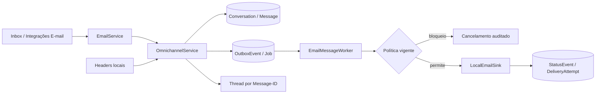

# Canal de e-mail — CRM-45

## Capacidade entregue

A CRM-45 especializa `Conversation` e `Message` para e-mail sem criar uma
segunda inbox. O único transporte executável é `LOCAL_SINK`: ele valida o
comando, produz um identificador determinístico, persiste aceite local e nunca
abre socket, resolve DNS ou transmite dados. SMTP externo existe somente como
porta isolada e fail-closed; o runtime não fornece implementação nem segredo.

Estado honesto da ativação:

| Capacidade | Estado |
|---|---|
| Entrada, saída, threading e status locais | Validado localmente |
| Sender fictício `crm@demo.politizai.local` | Local, não entregável |
| SPF, DKIM, DMARC e alinhamento | `PENDING_EXTERNAL` / não consultados |
| Credencial SMTP, webhook e unsubscribe | referências ausentes |
| Provider, domínio, mailbox e sandbox reais | adiados |
| Egress externo | bloqueado |

## Arquitetura



`EmailConnectionProfile` guarda sender, envelope-from, reply-to, domínio, modo
operacional e projeção de entregabilidade. `EmailMessageProfile` guarda
`Message-ID`, `In-Reply-To`, `References`, hashes e IDs específicos do
transporte. `EmailRecipient`, `EmailDomainObservation`, `EmailSuppression` e
`EmailEventReview` mantêm destinatários, observações, bloqueios e ambiguidades
em tabelas tipadas por workspace.

Segredos nunca são colunas do profile. Somente aliases e referências existem
em `IntegrationSecretReference`; o seed marca todas como `present=false`.

## Envio e segurança

O serviço de composição exige assunto, corpo, conversa autorizada, sender fixo
do workspace e destinatário derivado do `ContactPoint`. CR/LF e NUL em headers,
endereço inválido, ausência/excesso de destinatários e corpo acima do limite são
rejeitados. Não existe campo de UI para `From` arbitrário.

Antes do enqueue, o domínio de privacidade avalia finalidade, consentimento,
opt-out e ponto de contato. O worker repete a checagem operacional de
`doNotContact`, suppression, conexão ativa e modo `LOCAL_SINK`. Mudança ocorrida
entre composição e execução cancela `Message`, `OutboxEvent`, `Job` e tentativa
sem apagar eventos anteriores.

O worker usa PostgreSQL, `FOR UPDATE SKIP LOCKED`, lease com expiração,
idempotency key, retry/backoff limitado e estado terminal. Aceite do sink local
vira `PROVIDER_ACCEPTED` somente como simulação; ele não é `DELIVERED`.

## Threading

Thread é determinado por headers normalizados:

1. `In-Reply-To` exato encontra `EmailMessageProfile.messageIdHeader` no mesmo
   workspace;
2. o novo evento mantém `References` limitado e normalizado;
3. sem referência, o contato exato pode reutilizar uma conversa aberta;
4. referência presente, mas desconhecida, cria conversa separada e
   `EmailEventReview`;
5. assunto nunca une conversas.

Mensagem de saída responde à última mensagem do thread e estende `References`.
Correlação de provider futura deve usar `providerMessageId` no perfil
especializado; `Message.externalMessageId` não é reescrito após a criação.

## Entrada, MIME e HTML

O simulador local recebe remetente, assunto, texto, `Message-ID`,
`In-Reply-To`, `References` e horário. A fronteira futura deverá validar HMAC no
corpo bruto antes do parse, conferir tenant/profile, impor limite de tamanho e
persistir receipt/job antes do processamento assíncrono.

Os contratos atuais limitam corpo, destinatários, referências, partes e
anexos. O sanitizador remove scripts, conteúdo executável, event handlers e
URLs `javascript:`. Imagens remotas não são baixadas, e anexos permanecem
somente como referência opaca até existir storage/antivírus autorizado. HTML
sanitizado nunca substitui o texto/hashes canônicos silenciosamente.

## Estados e eventos

Estados suportados: `QUEUED`, `PROVIDER_ACCEPTED`, `SENT`, `DELIVERED`,
`DEFERRED`, `SOFT_BOUNCE`, `HARD_BOUNCE`, `COMPLAINT`, `REJECTED`, `FAILED`,
`REPLIED`, `UNSUBSCRIBED`, `CANCELLED` e `UNKNOWN_REVIEW`, além dos estados
canônicos anteriores. Cada mudança cria `MessageStatusEvent` com sequência,
origem, horário do provider e horário de ingestão. Evento atrasado é preservado,
mas não regride a projeção.

`DEFERRED` e `SOFT_BOUNCE` são transitórios e elegíveis a retry controlado.
`HARD_BOUNCE`, `COMPLAINT`, `REJECTED` e `UNSUBSCRIBED` são terminais para a
tentativa. Hard bounce, complaint e unsubscribe criam suppression append-only e
marcam o ponto de contato como não contatar.

HTTP 2xx, receipt ou aceite do sink não equivalem a entrega. Open/click não são
inferidos e não aparecem como métrica nesta fase.

## Unsubscribe e suppressions

O contrato de unsubscribe gera token opaco HMAC com workspace, e-mail,
finalidade e expiração. A ativação pública dessa rota depende de secret real,
domínio e provider homologados; por isso está adiada. No modo local, a tela de
integração permite simular hard bounce/complaint por serviço autorizado.

Suppressions são eventos `APPLIED` ou `RELEASED`; o estado vigente é o evento
mais recente. Liberar suppression no futuro exigirá permissão própria, motivo,
evidência válida e novo evento — nunca `UPDATE`/`DELETE` do fato anterior.

## RBAC e auditoria

Permissões específicas cobrem leitura, configuração, pausa, teste local,
gestão de sender, leitura de domínio, leitura/gestão de suppressions e replay de
evento. Visualizador não abre `/integracoes/email`; composição e leitura do
Inbox continuam sob as permissões canônicas da CRM-43.

Configuração, pausa, enqueue/bloqueio, aceite local, suppression, backfill e
eventos de revisão registram ator e workspace. Auditoria guarda hashes e códigos
seguros, nunca corpo integral, segredo ou credencial.

## Métricas

A central calcula do banco: fila, aceite local, sent, delivered, deferred, soft
bounce, hard bounce, complaints, replies e unsubscribes. O denominador é o total
de mensagens de e-mail no recorte do workspace. Taxas externas de entrega,
bounce, complaint, open e click não são declaradas como validadas sem provider
real e denominadores reconciliados.

## Seed, backfill e operação local

O seed cria profile local, configuração versionada, referências de segredo
ausentes, observação de domínio explicitamente não-DNS, template versionado e
três conversas fictícias (entrada, entrega local e soft bounce). Repetir o seed
não duplica dados.

Backfill conservador:

```bash
pnpm db:email:backfill
pnpm db:email:backfill -- --execute
```

O primeiro comando registra dry-run. O segundo cria somente perfis ausentes em
mensagens já classificadas como `EMAIL`. Destinatário não recuperável abre
revisão; nenhuma identidade é inferida. A mesma `runKey` retorna a execução
existente. A CLI recusa produção, host remoto, banco diferente de
`politizai_crm` ou schema diferente de `public`.

## Referências normativas consultadas

- RFC 5322 — formato, headers e identificação de mensagens:
  https://datatracker.ietf.org/doc/html/rfc5322
- RFC 3464 — Delivery Status Notifications:
  https://datatracker.ietf.org/doc/html/rfc3464
- RFC 8058 — one-click unsubscribe:
  https://datatracker.ietf.org/doc/html/rfc8058
- RFC 7489 — DMARC e alinhamento:
  https://datatracker.ietf.org/doc/html/rfc7489

Essas normas orientam o contrato; nenhuma validação de provider ou DNS foi
executada.

## Pendências externas obrigatórias

- escolher e homologar provider e transporte;
- obter domínio e mailbox autorizados;
- configurar secret store e rotação;
- publicar e validar SPF, DKIM e DMARC/alinhamento;
- implementar adaptador específico e webhook assinado do provider;
- homologar DSN, bounce, complaint, reply e unsubscribe real;
- validar limites, rate limits, reputação, quotas e observabilidade;
- executar reconciliação externa com evidências;
- revisar juridicamente finalidade, consentimento e opt-out;
- realizar segurança, privacidade e testes de carga antes de ativar egress.

Nada acima foi executado na CRM-45.
