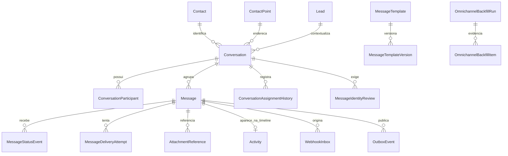

# Inbox omnichannel e contratos de comunicação

## Escopo da CRM-43

A CRM-43 cria a fonte canônica local de conversas e mensagens. Ela não conecta
WhatsApp, e-mail, telefonia, SMS ou Instagram a providers externos. O único
canal executável é `INTERNAL_SIMULATOR`, identificado como simulação na tela,
nos eventos e nos jobs. Os demais canais possuem contrato declarado para tasks
futuras, sem credencial, egress ou falsa entrega.

`Conversation` organiza contexto, responsabilidade e estado operacional;
`Message` é o fato de comunicação. A timeline comercial referencia a mensagem
por `Activity.messageId` e não duplica o corpo. `Lead`, `Contact`, `Account`,
`Opportunity`, `Meeting` e `RevenueLifecycle` continuam fontes próprias e podem
ser vinculados sem transferir ownership silenciosamente.

## Modelo relacional



`message_status_events`, `conversation_assignment_history` e
`omnichannel_backfill_items` rejeitam `UPDATE` e `DELETE`. A projeção atual
permanece em `Message.status` e nos campos de `Conversation`; eventos fora de
ordem são preservados, mas não fazem a projeção retroceder.

## Estados

Conversas usam `OPEN`, `PENDING_INTERNAL`, `WAITING_CUSTOMER`, `RESOLVED`,
`CLOSED` e `ARCHIVED`. Entrada coloca a conversa em `PENDING_INTERNAL`; saída
autorizada coloca em `WAITING_CUSTOMER`. Resolver e arquivar pausam o relógio,
e reabrir reinicia a espera sem apagar o histórico.

Mensagens distinguem rascunho, bloqueio de privacidade, fila interna, aceite
interno, aceite do provider, envio, entrega, leitura, resposta, falha transitória,
falha permanente, bounce e cancelamento. HTTP 2xx ou aceite interno não é
tratado como entrega. `MessageStatusEvent` conserva horário informado pelo
provider e horário de ingestão separadamente.

## Matriz de capacidades

| Canal | Estado nesta task | Entrada | Saída | Status | Observação |
|---|---|---:|---:|---:|---|
| Simulador interno | local executável | sim | sim | delivery/read/bounce | determinístico e sem egress |
| WhatsApp | fundação local CRM-44 | simulador + fronteira assinada bloqueada | saída local simulada | delivery/read/revisão | provider real e sandbox não validados; ver `WHATSAPP_CLOUD_API.md` |
| E-mail | local validado na CRM-45 | simulador com headers | sink local | delivery/bounce/complaint/reply | provider, domínio e sandbox externos adiados; ver `EMAIL_CHANNEL.md` |
| Telefonia | local validado na CRM-46 | callback local assinado | chamada simulada | fila/ringing/answer/terminal/revisão | provider, PSTN, gravação e transcrição adiados; ver `TELEPHONY_CHANNEL.md` |
| SMS | futuro | sim | sim | delivery | nenhum provider configurado |
| Instagram | simulador local | sim | sim | delivery/read | Direct, comentário, menção e resposta a story por fixtures; nenhum provider configurado |

A matriz tipada vive em
`src/modules/communications/domain/omnichannel-contracts.ts` e é exibida no
inbox para separar capacidade real, contrato preparado e ausência.

## Identidade e responsabilidade

O endereço é normalizado por canal e procurado exatamente em `ContactPoint`
dentro do workspace. Um único ponto com Lead ativo vincula a conversa. Endereço
inválido, nenhum match, múltiplos matches ou Contact sem Lead cria
`MessageIdentityReview` e encaminha a conversa à Fila Geral. Nenhum desses casos
cria Lead: criação continua exclusiva do `LeadIntakeService`.

Toda conversa acionável possui `assigneeMemberId` ou `queueId`. Claim e
transferência exigem permissão, revisão otimista e motivo. Alterar responsável
da conversa não altera owner do Lead, Account ou lifecycle.

## Privacidade, entrega e retry

Antes de enfileirar e antes de cada tentativa, o serviço chama a decisão
central da CRM-36 com `ContactPoint`, finalidade e canal exatos. `DENY` e
`REVIEW_REQUIRED` geram `BLOCKED_BY_POLICY`, sem outbox/job de entrega. Opt-out
ou revogação cancelam mensagens, outbox e jobs ainda compatíveis; fatos de
status anteriores permanecem append-only.

`WebhookInbox`, `OutboxEvent` e `Job` são reutilizados. Chaves idempotentes,
locks consultivos e retry de conflito serializável impedem efeito duplicado em
entrada concorrente. A entrega local aceita cenários determinísticos de aceite,
entrega, leitura, resposta, atraso, falha transitória, falha permanente e
bounce. Esta task não chama provider.

Referências de anexo guardam apenas metadata e `storageKey`; binário não é
persistido no PostgreSQL. MIME, tamanho e estado de scan possuem constraints.
Armazenamento real, antivírus e URLs assinadas ficam adiados.

## SLA e métricas

O relógio de conversa roda apenas em `PENDING_INTERNAL`, a partir de
`waitingSince`, e para quando a equipe responde. A meta inicial do inbox é 180
segundos e não altera a política comercial `SLA imediato — 0 minutos` da
entrada do Lead. O inbox calcula abertos, não lidos, vencidos, aguardando
contato, revisões de identidade, entradas, saídas e média da primeira resposta
somente com registros persistidos e escopo autorizado.

## Templates e backfill

Templates são locais, por workspace e versionados. Uma publicação cria nova
`MessageTemplateVersion`; conteúdo anterior não é reescrito. Variáveis são
allowlisted e escapadas antes da renderização.

O backfill é conservador e local-only:

```bash
pnpm db:omnichannel:backfill
pnpm db:omnichannel:backfill -- --execute
```

O primeiro comando registra a prévia. A execução preenche participante, hash e
evento de status ausentes sem inventar identidade. Replay da mesma `runKey`
devolve a execução persistida. A CLI recusa produção, host remoto, banco
diferente de `politizai_crm` e schema diferente de `public`.

## Limitações explícitas

- não há provider, credencial, webhook público ou egress;
- não há armazenamento de binários;
- políticas jurídicas continuam `PENDING_LEGAL`, então envio normal permanece
  bloqueado ou em revisão até aprovação externa legítima;
- retenção/redação física e busca textual avançada serão aprofundadas em tasks
  próprias de segurança/readiness;
- a CRM-44 acrescentou o profile, a janela de atendimento e a fronteira
  autenticada do WhatsApp, mas manteve egress e ativação externa bloqueados;
- e-mail possui fluxo local validado pela CRM-45, sem provider, domínio, mailbox,
  credencial ou egress;
- telefonia possui fluxo local validado pela CRM-46, sem provider, número, PSTN,
  áudio, gravação, transcrição, credencial ou egress.
