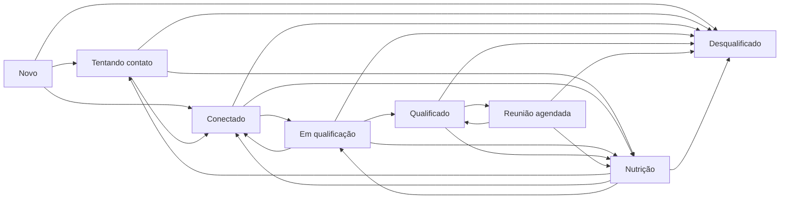

# Pipeline de pré-vendas

## Fonte da verdade

O pipeline padrão de entidade `LEAD` pertence ao workspace. Cada etapa ativa
possui um `leadStageCode` tipado e único; nomes e posições são apresentação,
enquanto o código dá estabilidade às regras. O estado atual fica em `Lead` e
cada permanência temporal em `StageHistory`.

| Código | Nome inicial | Estado projetado | Pré-requisitos |
|---|---|---|---|
| `NEW` | Novo | Aberto | Próxima ação |
| `TRYING_CONTACT` | Tentando contato | Aberto | Próxima ação |
| `CONNECTED` | Conectado | Aberto | Próxima ação |
| `IN_QUALIFICATION` | Em qualificação | Aberto | Próxima ação |
| `QUALIFIED` | Qualificado | Qualificado | PACTO apto, próxima ação e confirmação |
| `MEETING_SCHEDULED` | Reunião agendada | Qualificado | PACTO apto, próxima ação e confirmação |
| `NURTURING` | Nutrição | Aberto | Próxima ação |
| `DISQUALIFIED` | Desqualificado | Desqualificado | motivo persistido e confirmação |

Próxima ação significa ao menos uma `Task` ativa (`OPEN` ou `IN_PROGRESS`) do
lead. A projeção `nextAction*` é atualizada a partir dessa tarefa, mas não é
aceita sozinha como evidência. PACTO apto significa a revisão humana
`VALIDATED` mais recente com `isQualificationReady = true`.

## Grafo normal

`DISQUALIFIED` não possui saída normal. Uma correção fora do grafo requer
`leads.assign`, motivo e confirmação; `StageHistory.managerCorrection`, a
atividade e `AuditLog.action = lead.stage.manager_corrected` distinguem o fato.

## Transação e concorrência

1. O servidor autentica e autoriza o lead no workspace.
2. Um advisory lock serializa mutações do mesmo lead.
3. `expectedUpdatedAt` rejeita uma visão obsoleta.
4. O serviço valida etapa de destino, grafo e pré-requisitos.
5. O intervalo atual é fechado uma única vez e o seguinte é criado.
6. `Lead`, `Activity` e `AuditLog` são atualizados no mesmo commit.

Qualquer falha reverte todas essas operações. O banco rejeita reescrita,
exclusão e truncate de `StageHistory`; corrigir cria uma nova transição.

## Interface

`/pipeline` oferece quadro e lista, busca, filtros por responsável e prioridade,
contagens clicáveis por etapa e link para a lista completa. A projeção mostra no
máximo 20 cards por etapa para manter densidade; a contagem continua exata e a
interface informa quando existem registros adicionais. O cartão 360 reutiliza
o mesmo serviço. Estados vazio, loading, erro e sem permissão são explícitos.

Arrastar é permitido somente para uma transição normal sem confirmação ou dado
adicional. As demais transições usam o formulário explícito. Em ambos os casos,
o servidor repete todas as validações.
