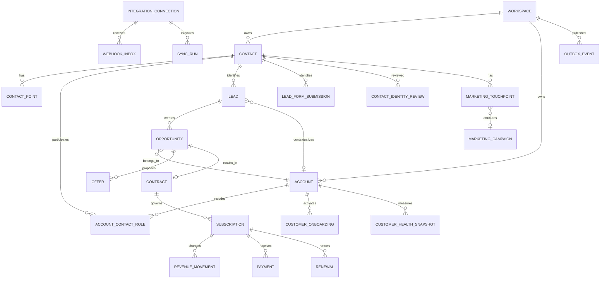
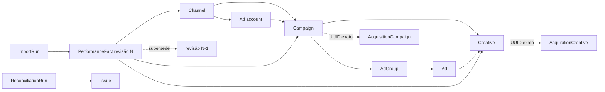

# Modelo de dados evolutivo — Politizai Revenue OS

## Estado e invariantes

Este catálogo orienta migrations futuras. A CRM-33 implementou somente a base
canônica de pessoa (`Contact`, `ContactPoint`, `ContactIdentityReview` e controle
do backfill); os demais agregados continuam planejados. Todo registro de negócio terá `workspaceId`, ID UUID estável, timestamps
em `timestamptz`, autoria quando mutável e FKs compostas que impeçam vínculo
entre workspaces. Valores monetários usam inteiros em centavos e moeda explícita.

Histórico, fatos de integração, eventos, consentimento, ledger e auditoria não
sofrem hard delete. Configurações e cadastros referenciados usam inativação.
JSON fica restrito a payload bruto minimizado, configuração flexível validada,
evidência e metadados que não sejam usados como filtro ou métrica principal.

## Identidade e contas

### `Contact`

Pessoa canônica implementada no workspace. Guarda nome preferido, nome legal
opcional, cargo/atuação, timezone, locale, origem da criação, estado de lifecycle,
qualidade, `mergedIntoContactId`, timestamps e soft delete. Não guarda um único
telefone ou e-mail como identidade absoluta.

### `ContactPoint`

Múltiplos pontos de contato por pessoa: tipo `PHONE` ou `EMAIL`,
valor original, valor normalizado, país, rótulo, primário, verificação, qualidade,
fonte, `doNotContact`, timestamps e estado. Unicidade é por workspace, Contact,
tipo e valor normalizado ativo. Valores iguais em Contacts diferentes são
indexados para detecção e abrem revisão; não são rejeitados nem mesclados
automaticamente, pois telefones/e-mails compartilhados são possíveis.

As constraints parciais garantem um único valor ativo repetido dentro do mesmo
Contact e um único ponto primário ativo por tipo. Elas deliberadamente permitem
o mesmo valor em Contacts distintos para que a revisão humana, e não uma
constraint destrutiva, resolva a ambiguidade.

### `ContactIdentityReview`

Fila implementada de colisão com Contact principal/candidato, Lead, ponto,
motivo, evidência, fingerprint, decisão e atores de criação/resolução. A CRM-33
permite confirmar que os contatos devem permanecer separados; merge continua
fora do escopo e não é inferido automaticamente. Submissões, atividades,
oportunidades e IDs antigos não são apagados.

### `ContactBackfillRun` e `ContactBackfillItem`

Execução persistida, paginada e idempotente do vínculo legado. `Run` guarda
modo dry-run/execute, status, cursor, lote, totais e erro; `Item` guarda o
resultado por Lead e sua chave idempotente. Pausa/retomada, falha atômica e lock
por workspace permitem repetir o processo sem duplicar Contact ou ContactPoint.

### `Account`

Organização, cliente ou unidade econômica: nome, nome legal, documento
normalizado opcional, domínio, segmento, porte, território, parent account,
lifecycle, owner e soft delete. Documento/domínio são sinais, não autorização
para merge destrutivo.

### `AccountContactRole`

Relação N:N entre Account e Contact: função, influência, autoridade, champion,
decisor, usuário, financeiro, início/fim e fonte. Histórico de papel não é
reescrito.

### `BuyingCommittee`

Contexto do comitê por oportunidade/conta. `BuyingCommitteeMember` referencia
`AccountContactRole`, papel na decisão, apoio, risco, participação e evidência.
PACTO continua qualificação do lead; comitê não substitui a dimensão Tomada de
decisão.

## Lifecycle e ownership

### `RevenueLifecycle`

Projeção corrente por Contact e/ou Account com estágio tipado: prospect, lead,
qualificado, oportunidade, cliente, onboarding, ativo, renovação, churn ou
inativo. Só muda por serviço e evento válido.

### `LifecycleHistory`

Intervalos de entrada/saída, ator, origem, motivo, correlação e regra usada.
Permite aging e conversão passados sem inferir pelo estado atual.

### `OwnershipAssignment`

Responsabilidade temporal por agregado e função (`MARKETING`, `SDR`, `CLOSER`,
`CS`, `FARMER`, `FINANCE`, `REVOPS`): membro ou fila, início, fim, motivo,
atribuição e source event. Um estágio que exige dono não aceita ausência; fila é
responsável explícito.

Implementado na CRM-35 com `OwnershipTransfer`, que preserva o owner vigente
até aceite explícito, e `LifecycleRuleVersion`, que torna a matriz reproduzível.
Os detalhes de invariantes, dual write e backfill estão em
`docs/LIFECYCLE_AND_OWNERSHIP.md`.

## Privacidade e governança

### `ProcessingPurpose` e `LegalBasis`

Catálogos versionados do workspace. Finalidade define canais, dados necessários,
base legal permitida, período de retenção e versão do texto apresentado.

### `ConsentEvent` e `ConsentState`

Implementados na CRM-36. O evento append-only por Contact/ContactPoint,
finalidade e canal registra concessão, negativa, revogação, opt-out ou correção,
texto/versão, origem, prova, instante do fato e da captura. O estado corrente é
uma projeção determinística, nunca substitui eventos anteriores. Sinal legado
sem prova permanece `REVIEW_REQUIRED`.

### `DataSubjectRequest` e `RetentionAction`

Implementados como fundação técnica na CRM-36: pedidos de acesso, correção,
portabilidade, oposição, revogação e eliminação; legal hold, aprovação, escopo,
preview, evidência e auditoria. A política inicial fica `PENDING_LEGAL` e apenas
gera `REVIEW`; eliminação/anonimização real não foi ativada.

## Plataforma de integrações

### `IntegrationConnection`

Workspace, provider, ambiente `SANDBOX`/`HOMOLOGATION`/`PRODUCTION`, status,
escopos concedidos, identificadores externos, referência do segredo, fingerprint,
health e timestamps. Nunca guarda token em texto claro.

### `SyncRun` e `SyncCursor`

Execução, direção, entidade, janela, contagens, status, erro controlado e
checkpoint monotônico. Cursor é versionado por conexão/stream e só avança após
commit dos efeitos.

### `ExternalObjectMapping`

Mapeia provider, tipo e ID externo para entidade interna, versão externa,
hash, primeiro/último sync e estado. Unicidade impede duas identidades internas
para a mesma chave externa sem reconciliação explícita.

### `WebhookInbox`

Envelope imutável: provider, connection, external event ID, assinatura validada,
tipo, payload bruto minimizado/criptografado quando necessário, receivedAt,
occurredAt, estado, tentativas e retenção. Único por conexão/event ID.

### `OutboxEvent`

Evento de domínio gravado na mesma transação do agregado: tipo/versão, agregado,
correlação, payload mínimo, estado de publicação e tentativas. `OutboxDelivery`
registra entrega por consumidor sem duplicar efeito.

`WebhookEvent` atual será preservado e migrado/ligado ao inbox por fase; `Job`,
`AutomationRun` e `AutomationEffect` continuam como infraestrutura de execução.

## Marketing e atribuição

### Hierarquia

- `MarketingChannel` e `AdAccount` identificam canal/conta externa;
- `MarketingCampaign` referencia ou expande `AcquisitionCampaign`;
- `MarketingAdGroup` representa conjunto/grupo;
- `MarketingAd` representa anúncio;
- `MarketingCreative` referencia ou expande `AcquisitionCreative`;
- `MarketingPerformanceFact` guarda período, dimensões, impressões, alcance,
  cliques, conversões e custo em centavos, com provider/provenance.

Nomes e IDs externos não substituem IDs internos. Fatos são únicos por conexão,
dimensão, granularidade e período; correções do provider geram nova versão ou
upsert auditado pela chave oficial.

### Jornada

- `LandingPage`/`LandingPageVersion` e `MarketingForm`/`MarketingFormVersion`
  são definições correntes com versões imutáveis;
- `MarketingSession` guarda identificador público opaco, início/última visão e
  associação opcional ao Contact, sem cookie bruto;
- `MarketingTouchpoint` liga Contact/Lead/Session às dimensões legadas de
  aquisição, com UTM normalizada, referrer reduzido, click ID hasheado,
  decisão de privacidade, elegibilidade e classe de evidência;
- `AttributionConversion` registra o evento canônico medido;
- `AttributionModelVersion` define algoritmo, janela, política e hash;
- `AttributionRun` e `AttributionCredit` persistem o cálculo. Cada conversão
  recebe exatamente 10.000 basis points, incluindo o bucket `UNKNOWN` quando
  não existe touchpoint elegível;
- `AcquisitionDataQualityIssue`, `MarketingBackfillRun` e
  `MarketingBackfillItem` mantêm cobertura, revisão e reconciliação explícitas.

`LeadFormSubmission` continua payload/conversão de entrada e passa a referenciar
Contact, Session, Form e touchpoint por campos opcionais aditivos.

Essas tabelas foram implementadas na CRM-38 com FKs compostas por workspace,
índices temporais/dimensionais, constraints de crédito e triggers append-only.
O backfill não fabrica sessão, UTM ou click ID ausentes.

## Geografia

Na implementação da CRM-42, `GeographicLocation` representa país, região, UF,
município, prefixo postal e coordenada opcional em uma dimensão canônica.
`GeographicObservation` guarda o fato temporal append-only e
`GeographicProfile` sua projeção atual; divergências viram
`GeographicDataIssue`. `Territory` é versionado e `TerritoryMembership` liga o
alvo à versão resolvida sem alterar owner. Cidade e estado textuais atuais são
preservados; o backfill local só promove valores explícitos, não inventa
coordenadas e geocodificação externa permanece adiada.

## Comunicação e agenda

`ChannelAccount` vincula conexão e remetente. `Conversation` e `Message` atuais
são expandidos com channel account, IDs externos, thread, status de entrega e
consent purpose. `MessageDeliveryAttempt` registra tentativas e callbacks.

`CallRecord` guarda direção, número mascarável, início/fim, resultado, recording
reference e consentimento; conteúdo não é obrigatório. `CalendarBinding` e
`ExternalCalendarEvent` mapeiam `Meeting` sem substituir sua agenda interna.
`Activity` continua timeline oficial e aponta para fatos de canal quando houver.

## Venda, contratos e receita

### Projeção analítica da CRM-57

Nenhuma tabela foi criada. `RevenueMovement` continua sendo o ledger
append-only; `OpportunityOutcomeSnapshot`, `ContractVersion`, `Payment`,
`Renewal`, `ChurnEvent`, `MarketingPerformanceFact` e `ForecastSnapshot`
continuam fatos canônicos. A projeção em memória leva versão e corte e nunca
regrava esses fatos, evitando uma segunda fonte da verdade.

`Opportunity`, `Offer`, `StageHistory` e seus IDs são preservados. Futuramente
ganham `contactId`, `accountId` e buying committee opcionais.

### `Contract` e `ContractVersion`

Contrato comercial vinculado a Opportunity/Offer/Account, número, status,
vigência, moeda, valor, versão, termos estruturados mínimos, assinatura e
document reference. Alteração cria versão; documento é armazenado fora do banco
com checksum e autorização.

### `Subscription` e `SubscriptionItem`

Assinatura recorrente, conta, contrato, produto/oferta, status, início, renovação,
cancelamento, quantidade, preço em centavos e periodicidade. Não substitui
catálogo nem contrato.

### `RevenueMovement`

Ledger comercial append-only: `NEW`, `EXPANSION`, `CONTRACTION`, `RENEWAL`,
`CHURN`, `REACTIVATION`, valor MRR/ARR/TCV e effectiveAt. Chave idempotente
impede dupla receita. Correção usa movimento reversor.

### `Invoice` e `Payment`

Projeção mínima de cobrança e recebimento: valor, vencimento, status, provider,
external ID e timestamps. Não há impostos, partidas contábeis, conciliação
bancária ampla ou contas a pagar. Webhook de pagamento é evidência até passar
pelo serviço e reconciliação.

## Onboarding, CS e atendimento

### `CustomerOnboarding` e `OnboardingMilestone`

Expansão de `CustomerHandoff`: conta, contrato, owner, início, prazo, status,
critério de ativação, marcos, bloqueios e conclusão. Handoff aceito cria o plano;
ganho isolado não marca ativação.

### `CustomerPortfolioAssignment`

Ownership temporal de CS/Farmer por Account, reutilizando `OwnershipAssignment`
ou especialização com capacidade/carteira configurada.

### `SuccessPlan`, `SuccessGoal` e `CustomerHealthSnapshot`

Objetivos, resultados esperados, próximos passos e health versionado. Health
guarda componentes, evidência, regra e versão; ausência de sinal não é risco.
Sinal de uso de produto só entra quando houver integração confiável.

### `CustomerRequest` e `SatisfactionResponse`

Solicitação limitada a contexto de cliente/receita, SLA, owner, status e
resolução; CSAT/NPS registra pergunta/versionamento, escala, resposta e canal.
Não há catálogo genérico de ITSM ou central de suporte multidepartamental.

Na CRM-53, `CustomerRequest` referencia `Account`, contato opcional, owner ou
fila explícita, equipe e `CustomerServiceSlaPolicyVersion`. Datas-limite e fatos
de primeira resposta/resolução são colunas tipadas. `CustomerRequestEvent` é
append-only e sequencial por solicitação. `CustomerSurveyDefinition`/
`CustomerSurveyVersion` congelam tipo, pergunta, escala e vigência;
`CustomerSurveyInvitation` e `CustomerSurveyResponse` separam convite de fato
respondido, e correções usam `supersedesId`. FKs compostas por workspace e
`ON DELETE RESTRICT` impedem vínculos cruzados e cascatas históricas.

## Renovação, expansão e churn

`Renewal` referencia Subscription/Contract/Account, data alvo, owner, valor,
risco, status, decisão e motivo. `ExpansionSignal` é evidência; uma expansão
comercial confirmada cria `Opportunity`. `ChurnEvent` registra logo/revenue
churn, motivo, effectiveAt e movimentos relacionados. Renovação, contração e
churn nunca são inferidos só por contrato vencido.

### Implementação local da CRM-54

`Renewal` mantém projeção atual e snapshot financeiro; `RenewalEvent` mantém a
sequência factual append-only. `ExpansionSignal` só se torna oportunidade por
confirmação humana e a Opportunity resultante referencia o sinal original.
`FarmerRevenueDecision` liga contração/churn ao movimento exato do ledger;
`ChurnEvent` distingue logo e receita. Correções criam `REVERSAL` e preservam o
fato original. Todas as FKs críticas são compostas por workspace e todas as
chaves idempotentes são únicas no tenant.

## Metas, quotas e forecast

`GoalPlan` define período civil/timezone e versão. `Quota` relaciona membro,
equipe ou função a métrica e alvo em quantidade/bps/centavos. `ForecastSubmission`
registra categoria, valor, comentário e snapshot das oportunidades consideradas.
`ForecastSnapshot` preserva pipeline, weighted pipeline manual, commit, best
case e data de corte. Alterar o estado atual não reescreve forecast passado.

### Implementação local da CRM-55

`GoalPlan` e `GoalQuota` materializam a parte de metas sem antecipar forecast.
O plano separa rascunho, publicação e retirada; versões novas apontam para a
versão substituída. A quota guarda métrica, unidade, valor inteiro e exatamente
um alvo (`WorkspaceMember`, `Team` ou `OwnershipFunction`). A precedência
efetiva é pessoa, equipe e função. `GoalPlanEvent` preserva a timeline
append-only; `GoalBackfillRun`/`GoalBackfillItem` documentam sinais legados sem
fabricar alvo oficial. FKs compostas por workspace, checks de unidade/valor e
triggers protegem tenant, história e imutabilidade após publicação.

### Implementação local da CRM-56

`ForecastCycle` congela período, timezone, moeda e escopo por workspace, equipe
ou função. `ForecastSubmission` e `ForecastSubmissionItem` preservam a leitura
humana e a composição observada em cada revisão; correções apontam para a versão
anterior e exigem motivo. `ForecastSnapshot` e `ForecastSnapshotItem` congelam o
universo elegível, exclusões, pipeline, best case, commit, realizado, meta,
cobertura e fingerprint do corte. `managerOverrideCents` e
`bottomUpCommitCents` são campos distintos. `ForecastBackfillRun` e
`ForecastBackfillItem` registram somente diagnóstico conservador.

Checks garantem totais cumulativos (`commit ≤ best case ≤ pipeline`), centavos
não negativos, categoria exclusiva e cobertura coerente. FKs compostas impedem
vínculos entre workspaces. Triggers rejeitam update/delete de fatos históricos e
congelam campos materiais do ciclo depois do primeiro snapshot.

## Qualidade de dados e IA

`DataQualityRule`, `DataQualityRun` e `DataQualityIssue` guardam regra, versão,
evidência, severidade, owner e resolução. Correção usa o serviço do agregado.

`AIInsight` atual permanece. Futuramente `AIProviderConfiguration`,
`PromptVersion`, `AIEvaluationRun` e `AIApproval` poderão tornar provider real
governado. Segredo não fica nessas tabelas. n8n usa `IntegrationConnection`,
inbox/outbox e APIs; não recebe model de acesso ao banco.

## Relações principais

## Índices e constraints

- todo FK de agregado inclui `workspaceId`;
- índices de owner/fila/estado/próxima ação/occurredAt/effectiveAt;
- unicidade parcial implementada para contact point ativo e ponto primário;
- FKs compostas implementadas entre Contact, Lead, submissão, review e backfill;
- checks de centavos não negativos quando a semântica exigir;
- basis points entre 0 e 10.000;
- intervalos com fim posterior ao início;
- um único lifecycle/ownership corrente por agregado/função;
- um único cursor por conexão/stream;
- uma única chave de inbox/outbox/ledger por workspace e origem;
- índices de período/dimensão em fatos de marketing e receita;
- triggers append-only onde o serviço sozinho não for defesa suficiente.

## Compatibilidade e contract futuro

Campos antigos só poderão ser removidos depois de backfill reconciliado, dual
write observado, leituras migradas, rollback testado e backup validado. A CRM-33
preservou `Lead.phoneNormalized`, email, organização, cidade e estado e manteve
o fluxo legado legível; nenhum contract foi autorizado. Account, lifecycle e
merge canônico permanecem para tasks posteriores.

## Contas e comitê de compra — CRM-34

`Account` é a identidade canônica da organização no workspace. Documento e
domínio preservam valor original e normalizado; segmento, porte, status,
qualidade e hierarquia são colunas tipadas. `Lead.accountId` e
`Opportunity.accountId` são opcionais para separar ausência de confirmação de
uma afirmação negativa. A hierarquia usa FK composta por workspace, bloqueio de
auto-parentesco e validação de ciclo no serviço.

`AccountContactRole` modela a relação temporal N:N com `Contact`, incluindo
papel, influência, autoridade, origem e evidência. Alterações encerram o papel
anterior e criam outro; índice parcial impede duplicidade ativa concorrente.
`BuyingCommittee` pertence simultaneamente à oportunidade e à conta, admite no
máximo uma versão aberta por oportunidade e contém membros que referenciam
papéis ativos da mesma conta. Ganho, perda ou merge de contas não foram
automatizados nesta task.

`AccountIdentityReview`, `AccountCandidate`, `AccountBackfillRun` e
`AccountBackfillItem` mantêm a migração legada rastreável. Nome livre de
organização apenas abre candidato com fato, inferência e dados ausentes; nunca
cria nem vincula conta automaticamente.

## Hierarquia e fatos de mídia — CRM-39

Todas as chaves relacionais relevantes carregam `workspaceId`; FKs compostas
rejeitam vínculo cruzado. Métricas permanecem em colunas `BIGINT`, dinheiro em
centavos e datas em `TIMESTAMPTZ`. JSON guarda somente a evidência original e a
configuração versionada. Exclusão lógica vale à hierarquia; fatos não são
apagados nem atualizados.
