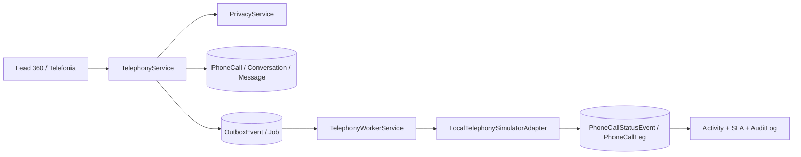

# Canal de telefonia — CRM-46

## Capacidade entregue

A CRM-46 implementa uma fundação de telefonia executável apenas no simulador
local determinístico. A interface, os serviços, a fila PostgreSQL, os eventos,
os resultados comerciais e as métricas são reais e persistidos; não existe
PSTN, SIP, áudio, gravação, transcrição, credencial ou egress externo.

| Capacidade | Estado |
|---|---|
| Iniciar, cancelar e classificar uma ligação | validado localmente |
| Estados técnicos e múltiplas pernas | validado localmente |
| Retry, backoff, dead-letter e replay | validado localmente |
| Callback local assinado e idempotente | validado localmente |
| Gravação e transcrição | desativadas; referências ficam `NULL` |
| Provider, número, PSTN e sandbox reais | adiados |

## Arquitetura



`TelephonyService` é a porta de aplicação. Ele deriva o workspace da sessão,
resolve Lead, Contact, Account, Opportunity ou Meeting, revalida o alvo dentro
da transação e aplica RBAC, privacidade, opt-out, janela de contato e owner/fila
explícitos antes do enqueue. A mesma transação cria `Conversation`, `Message`,
`PhoneCall`, o primeiro evento, `OutboxEvent`, `Job` e auditoria.

O worker usa `FOR UPDATE SKIP LOCKED`, lease, tentativas persistidas, retry com
backoff limitado e estado terminal. `LocalTelephonySimulatorAdapter` cobre
atendimento, ocupado, não atendimento, cancelamento, caixa postal, transferência,
falha transitória, falha permanente e timeout. O adapter externo existente é
fail-closed e não possui transporte.

## Modelo e fatos

`PhoneCall` é a projeção atual e referencia a conversa/mensagem canônicas, o
alvo comercial, a atribuição e o profile usado. `PhoneCallStatusEvent` é o fato
append-only; eventos repetidos ou atrasados não fazem a projeção retroceder e
abrem `TelephonyEventReview` quando não podem ser aplicados com segurança.

`PhoneCallLeg` representa caller/callee/agente/cliente e pernas de transferência
sem fingir uma sequência única. `PhoneCallAttempt` guarda cada execução do
worker. `TelephonySuppression` e itens de backfill são append-only. Todas as
relações incluem `workspaceId` e usam exclusão restritiva para preservar o
histórico.

Os campos `recordingReference` e `transcriptionReference` existem como fronteira
futura, mas o modo `LOCAL_SIMULATOR` possui constraint que impede qualquer
referência e exige `recordingEnabled=false`/`transcriptionEnabled=false` no
profile. Nenhum binário é salvo.

## Estados, eventos e resultado humano

Estados técnicos suportados: `QUEUED`, `INITIATED`, `RINGING`, `ANSWERED`,
`COMPLETED`, `BUSY`, `NO_ANSWER`, `CANCELLED`, `FAILED`, `VOICEMAIL` e
`REVIEW_REQUIRED`. Sequência e horário do fato são preservados separadamente do
horário de ingestão.

O resultado humano é separado do estado técnico: `CONNECTED`, `NO_ANSWER`,
`BUSY`, `WRONG_NUMBER`, `VOICEMAIL`, `CALLBACK_REQUESTED`,
`MEETING_SCHEDULED`, `NO_INTEREST` ou `OTHER`. `OTHER` exige nota e retorno
solicitado exige próxima ação. Registrar resultado cria uma única atividade
canônica, pode criar a tarefa explícita seguinte e não move pipeline.

`firstHumanAttemptAt` é preenchido na primeira tentativa real de telefonia e
nunca reescrito. `firstConnectedAt` é preenchido no evento `ANSWERED`, não na
conclusão. Os segundos de tentativa e resposta continuam derivados dos
timestamps persistidos pela camada operacional.

## Privacidade e segurança

- telefone precisa ser normalizável para E.164 e ter DDI explicitamente
  reconhecido; caso contrário, a operação vai para revisão;
- ponto de contato, finalidade, consentimento, opt-out e `doNotContact` são
  avaliados antes de criar a tentativa;
- a janela é calculada em `America/Sao_Paulo` pela configuração versionada;
- callback local exige assinatura HMAC do corpo bruto, limite de 64 KiB e
  metadados allowlisted;
- logs e auditoria usam telefone mascarado/hash, códigos e IDs; não guardam
  segredo, áudio ou payload livre;
- replay e redisposição exigem permissões próprias e continuam idempotentes.

## RBAC

Administrador configura e opera no workspace. Gestor lê, inicia, cancela,
classifica e reprocessa no escopo de equipe. SDR e Closer operam somente alvos
próprios; pertencer à mesma fila/equipe não amplia um escopo `OWN`.
Visualizador consulta a central sanitizada no workspace, mas não recebe nenhuma
mutação. O worker sempre usa o ator Sistema persistido.

## Métricas locais

`/integracoes/telefonia` calcula do banco: ligações, tentativas técnicas,
conectadas, taxa de conexão, duração média, tempo médio de conversa, reviews
abertas e jobs em dead-letter. Ausência de denominador retorna `null`. Essas
métricas provam o fluxo local, não qualidade de carrier, gravação, ASR ou
entrega PSTN.

## Seed, backfill e operação

O seed idempotente cria um profile `LOCAL_SIMULATOR`, configuração versionada e
permissões por papel, sem segredo. Para revisar fatos legados:

```bash
pnpm db:telephony:backfill -- --run-key=crm46:dry:v1
pnpm db:telephony:backfill -- --execute --run-key=crm46:execute:v1
```

O backfill é conservador: uma `Message` legada de chamada sem fatos suficientes
vira revisão; não ganha duração, atendimento ou gravação inventados. A mesma
chave retorna o run existente. A CLI recusa produção, host remoto, banco
diferente de `politizai_crm` ou schema diferente de `public`.

## Pendências externas obrigatórias

- escolher e homologar provider e conta sandbox;
- contratar número e definir caller ID, países, tarifas e limites;
- configurar secret store, rotação, webhook e validação do provider;
- aprovar finalidade, base legal, janela de contato, retenção e política de
  gravação/transcrição com revisão jurídica;
- implementar consentimento de gravação e storage protegido antes de preencher
  qualquer referência;
- validar status, transferências, retry, rate limit e reconciliação reais;
- executar segurança, privacidade, acessibilidade e carga no ambiente de
  homologação antes de habilitar egress.

Nada acima foi executado na CRM-46.
